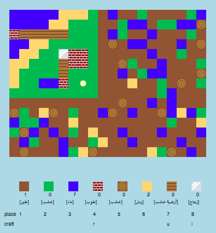

## المقدمة

في هذا المشروع، ستصمِّم وتبرمج تحسينات لنسخة ثنائية الأبعاد من لعبة ماين كرافت وتكتب تعليماتها البرمجية.

  <iframe src="https://trinket.io/embed/python/ebc5b0148b?outputOnly=true&start=result" width="600" height="500" frameborder="0" marginwidth="0" marginheight="0" allowfullscreen>
  </iframe>
  

### معلومات إضافية لقادة النادي

إذا كنت بحاجة إلى طباعة هذا المشروع، فيُرجى استخدام [النسخة القابلة للطباعة](https://projects.raspberrypi.org/en/projects/codecraft/print).

## \--- collapse \---

## title: ملاحظات قادة النادي

## مقدمة:

في هذا المشروع، سيتعرَّف الأطفال على سمات الرسومات وتصميم الألعاب بإجراء تحسينات على نسخة أساسية ثنائية الأبعاد من لعبة ماين كرافت. حيث سينشئ الأطفال موارد جديدة وقواعد صناعة لجمع الموارد الحالية وإنشاء موارد جديدة. وسيتم ذلك بفهم المتغيرات والقوائم والقواميس واستخدامها.

## الموارد المتوفرة على الإنترنت

**يستخدم هذا المشروع Python 3.** نوصي باستخدام [trinket](https://trinket.io/) لكتابة لغة Python على الانترنت. يحتوي هذا المشروع على Trinket التالية:

+ ['CodeCraft' starter project -- rpf.io/codecraft-on](http://rpf.io/codecraft-on)

وهناك أيضًا trinket تحتوي على المشروع المكتمل:

+ [مشروع 'صناعة الأكواد' مُكتمل -- trinket.io/python/ebc5b0148b](https://trinket.io/python/ebc5b0148b)

## الموارد المتوفرة دون اتصال بالإنترنت

يمكن أن يكون هذا المشروع [مكتمل دون اتصال بالإنترنت](https://www.codeclubprojects.org/en-GB/resources/python-working-offline/) إذا كنت تفضل ذلك. يمكنك الوصول إلى موارد المشروع من خلال النقر فوق رابط "مواد المشروع" الخاص بهذا المشروع. يحتوي هذا الرابط على قسم "موارد المشروع"، الذي يتضمن الموارد التي يحتاج إليها الأطفال لإكمال هذا المشروع من دون اتصال بالإنترنت. تأكد من أن كل طفل لديه إمكانية الوصول إلى نسخة من هذه الموارد. يتضمن هذا القسم الملفات التالية:

+ codecraft/codecraft.py
+ codecraft/variables.py
+ codecraft/brick.gif
+ codecraft/dirt.gif
+ codecraft/glass.gif
+ codecraft/grass.gif
+ codecraft/plank.gif
+ codecraft/player.gif
+ codecraft/sand.gif
+ codecraft/water.gif
+ codecraft/wood.gif

يمكنك أيضًا العثور على نسخة مكتملة من هذا المشروع في قسم "موارد المتطوعين" ، والذي يحتوي على:

+ codecraft-finished/codecraft.py
+ codecraft-finished/variables.py
+ codecraft-finished/brick.gif
+ codecraft-finished/dirt.gif
+ codecraft-finished/glass.gif
+ codecraft-finished/grass.gif
+ codecraft-finished/plank.gif
+ codecraft-finished/player.gif
+ codecraft-finished/sand.gif
+ codecraft-finished/water.gif
+ codecraft-finished/wood.gif

(جميع الموارد المذكورة أعلاه قابلة للتنزيل أيضًا كملفات بالامتداد `.zip`)

## أهداف التعلم

+ إنشاء الرسومات وتحريرها;
+ تصميم الألعاب؛
+ تعديل و تحرير: 
    + المتغيرات؛
    + القوائم;
    + القواميس.

يتناول هذا المشروع عناصر من معايير [المنهج الرقمي الخاص بـ Raspberry Pi ](http://rpf.io/curriculum):

+ [الأصول الأساسية للتصميمات ثنائية وثلاثية الأبعاد.](https://www.raspberrypi.org/curriculum/design/creator)

+ [دمج الإنشاءات البرمجية لحل مشكلة.](https://www.raspberrypi.org/curriculum/programming/builder)

## التحديات

+ "صمِّم عالمك" - لعب اللعبة مع وضع قوالب الموارد الحالية وصناعتها؛
+ "غيِّر حجم عالمك" - تعديل عرض الخريطة `MAPWIDTH` وارتفاعها `MAPHEIGHT` لتغيير حجم عالم اللعبة;
+ "أنشئ مورد الرمل" - إنشاء مورد رمل جديدًا، إلى جانب استخدام بيانات اللعبة ذات الصلة.
+ "اصنع الزجاج من الرمل" - إنشاء مورد زجاج جديدًا يمكن صناعته من موارد أخرى.
+ "أنشئ موارد أخرى" - استخدام ما تم تعلمه لإنشاء قوالب موارد وقواعد صناعة أخرى.

## الأسئلة الشائعة

+ قد يحتاج الأطفال إلى التذكير باستخدام الفاصلة للفصل بين عناصر القاموس/القائمة. على سبيل المثال، عند إضافة عناصر مخزون ورسومات وقواعد صناعة إلى اللعبة.

\--- /collapse \---

## \--- collapse \---

## title: مواد المشروع

## موارد المشروع

+ [ملف.zip يحتوي على كل موارد المشروع](http://rpf.io/p/en/codecraft-go)
+ [Trinket عبر الإنترنت يحتوي على كل موارد مشروع 'صناعة الأكواد'](http://rpf.io/codecraft-on)

## موارد قائد النادي

+ [ملف.zip يحتوي على جميع موارد المشروع المكتملة](http://rpf.io/p/en/codecraft-get)
+ [مشروع Trinket المكتمل على الإنترنت](https://trinket.io/python/ebc5b0148b)

\--- /collapse \---