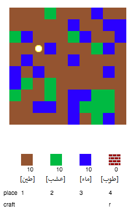
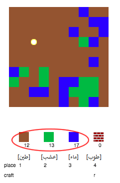
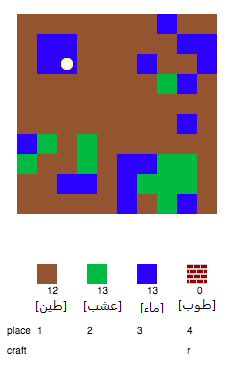
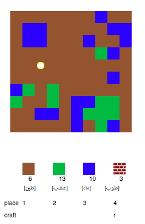
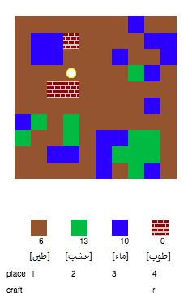

## لعب اللعبة

+ Open this trinket: [rpf.io/codecraft-on](http://rpf.io/codecraft-on){:target="_blank"}.

+ استخدم مفاتيح WASD على لوحة المفاتيح لتحريك اللاعب في كل مكان في عالم اللعبة المليء بالموارد المختلفة (التراب والحشائش والماء).
    
    

+ يمكنك الضغط على مفتاح المسافة لجمع الموارد. اجمع بعض المربعات من كل نوع من الموارد وسترى أنها أضيفت إلى المخزون.
    
    

+ اضغط على مفاتيح الأرقام (1 إلى 3) لوضع مورد على الخريطة. على سبيل المثال، اضغط على 3 لتضع بعض مربعات الماء على الخريطة. ولن يمكنك القيام بذلك إلا إذا كان لديك بعض مربعات الماء في المخزون.
    
    

+ يمكنك صناعة عنصر بالضغط على المفتاح الذي يظهر في القائمة. والمقصود بالصناعة هو جمع العناصر الموجودة بالفعل في المخزون لإنشاء عناصر جديدة. جرِّب الضغط على المفتاح 'R' لصناعة طوبة جديدة (إذا كان لديك مربعان من التراب ومربع واحد من الماء في المخزون).
    
    

+ يمكنك بعد ذلك الضغط على المفتاح '4' لوضع الطوب الذي صنعتَه على الخريطة.
    
    