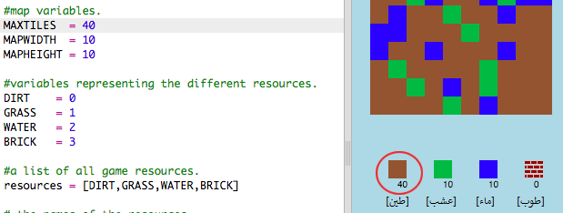

## تخصيص اللعبة

لنعدِّل بعض المتغيرات لنغيِّر طريقة عرض اللعبة.

+ انقر فوق الملف `variables.py` لترى بعض المتغيرات التي يمكن تغييرها.
    
    

+ غيِّر قيمة المتغير `BACKGROUNDCOLOUR`، وانقر فوق 'Run' لترى التغيير الذي حدث في اللعبة.
    
    

+ يمثل المتغير `MAXTILES` كمية المربعات التي يمكن أن يستوعبها المخزون من كل مورد. غيِّر هذا المتغير إذا كنت تريد تخزين أكثر (أو أقل) من 20 مربعًا من كل مورد.
    
    