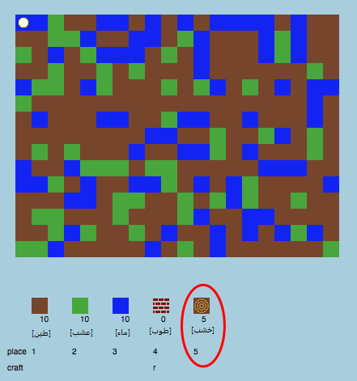

## إنشاء مورد خشب جديد

لننشئ مورد خشب جديدًا. لتفعل ذلك، ستحتاج إلى إضافة بعض المتغيرات في الملف `variables.py`.

+ أولًا، تحتاج إلى تعيين رقم إلى المورد الجديد. وسيمكنك عندئذٍ استخدام الكلمة `WOOD` في التعليمات البرمجية بدلًا من الرقم 4.
    
    

+ يجب أن تضيف مورد `WOOD` الجديد إلى القائمة `resources`.
    
    

+ يجب أن تعيِّن اسمًا إلى هذا المورد أيضًا، بحيث يظهر في المخزون.
    
    
    
    لاحظ وجود الفاصلة `,` في نهاية الأسطر أعلاه.

+ سيحتاج هذا المورد إلى صورة أيضًا. يحتوى المشروع بالفعل على صورة تُسمى `wood.png` يجب أن تضيفها إلى القاموس `textures`.
    
    

+ أضف عدد مربعات المورد التي يجب أن تكون موجودة في `inventory` عندما تبدأ.
    
    

+ وأخيرًا، أضف المفتاح الذي ستضغط عليه لوضع الخشب في عالمك.
    
    

+ شغِّل مشروعك لتختبره. سترى الآن أن المورد 'wood' الجديد قد أضيف إلى المخزون.
    
    

+ لا يوجد خشب في عالمك! لإصلاح ذلك، انقر فوق الملف`main.py` وابحث عن الدالة `()generateRandomWorld`.
    
    
    
    تنشئ هذه التعليمة البرمجية عددًا عشوائيًا بين 0 و10، وتستخدم العدد لتحديد المورد الذي سيتم وضعه على خريطة عالمك:
    
    + 1 أو 2 = الماء
    + 3 أو 4 = الحشائش
    + غير ذلك = التراب

+ أضف هذه التعليمة البرمجية لإضافة خشب إلى عالمك متى كانت قيمة `randomNumber` هي 5.
    
    

+ اختبر مشروعك مرة أخرى. في هذه المرة، ستلاحظ ظهور بعض مربعات الخشب على خريطة عالمك.
    
    