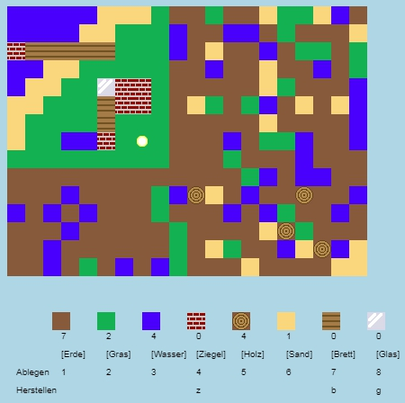

## Einleitung

In diesem Projekt wirst du Verbesserungen für eine 2D Version von Minecraft konzipieren und programmieren.

  <iframe src="https://trinket.io/embed/python/69c378bd37?outputOnly=true&start=result" width="600" height="500" frameborder="0" marginwidth="0" marginheight="0" allowfullscreen>
  </iframe>
  

### Zusätzliche Informationen für Clubleiter

Falls Sie dieses Projekt ausdrucken müssen, verwenden Sie bitte die [druckfreundliche Version](https://projects.raspberrypi.org/de-DE/projects/codecraft/print).

--- collapse ---
---
title: Hinweise für Clubleiter
---

## Einleitung:

In diesem Projekt lernen Kinder Aspekte des Grafik- und des Spieldesigns, indem sie Verbesserungen an einem einfachen 2D-Minecraft-Klon vornehmen. Kinder schaffen neue Ressourcen sowie Regeln für die Kombination von Ressourcen, um neue zu erschaffen. Dies wird durch das Verstehen und Anwenden von Variablen, Listen und dictionaries erreicht.

## Online-Ressourcen

**Dieses Projekt verwendet Python 3.** Wir empfehlen die Verwendung von [trinket](https://trinket.io/), um Python-Programme online zu schreiben. Dieses Projekt enthält folgende Trinkets:

+ ['CodeCraft' Startpunkt -- rpf.io/codecraft-on](https://trinket.io/python/496e9e12ee)

Außerdem ist ein trinket mit dem vollständigen Projekt verfügbar:

+ [Fertiges 'CodeCraft' Projekt - trinket.io/python/ebc5b0148b](https://trinket.io/python/ebc5b0148b)

## Offline-Ressourcen

Falls es erwünscht sein sollte, kann dieses Projekt auch [offline durchgeführt werden](https://www.codeclubprojects.org/en-GB/resources/python-working-offline/). Sie können auf die Projektressourcen zugreifen, indem Sie auf den Link "Projektmaterial" für dieses Projekt klicken. Dieser Link enthält einen Abschnitt "Projektressourcen" mit Ressourcen, die die Kinder benötigen, um das Projekt offline abschließen zu können. Stellen Sie sicher, dass jedes Kind Zugriff auf eine Kopie dieser Ressourcen hat. Dieser Abschnitt enthält die folgenden Dateien:

+ codecraft/codecraft.py
+ codecraft/variables.py
+ codecraft/brick.gif
+ codecraft/dirt.gif
+ codecraft/glass.gif
+ codecraft/grass.gif
+ codecraft/plank.gif
+ codecraft/player.gif
+ codecraft/sand.gif
+ codecraft/water.gif
+ codecraft/wood.gif

Eine vollständige Version dieses Projekts finden Sie auch im Abschnitt "Ressourcen für Freiwillige Mitarbeiter" mit diesem Inhalt:

+ codecraft-finished/codecraft.py
+ codecraft-finished/variables.py
+ codecraft-finished/brick.gif
+ codecraft-finished/dirt.gif
+ codecraft-finished/glass.gif
+ codecraft-finished/grass.gif
+ codecraft-finished/plank.gif
+ codecraft-finished/player.gif
+ codecraft-finished/sand.gif
+ codecraft-finished/water.gif
+ codecraft-finished/wood.gif

(Alle oben genannten Ressourcen können auch als `.zip`-Dateien für Projekte und für Freiwillige heruntergeladen werden.)

## Lernziele

+ Erstellen und Bearbeiten von Grafiken
+ Spieledesign
+ Anwendung von: 
    + Variablen
    + Listen
    + Dictionaries.

Dieses Projekt umfasst Elemente aus den folgenden Zweigen des [Raspberry Pi Digital Making Curriculum](https://rpf.io/curriculum):

+ [Entwurf von grundlegenden 2D- and 3D-Konstruktionen.](https://www.raspberrypi.org/curriculum/design/creator)

+ [Kombination von verschiedenen Programmierstrukturen um ein Problem zu lösen.](https://www.raspberrypi.org/curriculum/programming/builder)

## Herausforderungen

+ "Errichte deine Welt" - Spielen des Spiels, Platzieren und Verwenden von vorhandenen Blöcken
+ "Die Grösse der Welt ändern" - ändern der Variablen `WELTBREITE` und `WELTHOEHE` um die Grösse der Welt zu ändern
+ "Erschaffen von Sand" - Eine neue Sand-Ressource zusammen mit zugehörigen Spieldaten programmieren.
+ "Herstellen von Glas aus Sand" - Herstellen einer neuen 'Glas'-Ressource, die weiter verarbeitet werden kann.
+ "Mehr Ressourcen erschaffen" - Das Gelernte anwenden, um mehr Blöcke und Regeln für die Herstellung zu erstellen.

## Häufig Gestellte Fragen

+ Kinder müssen möglicherweise daran erinnert werden, dass Elemente eines Wörterbuchs / einer Liste durch ein Komma getrennt werden. Zum Beispiel, wenn Inventarelemente, Grafiken und Herstellungsregeln zum Spiel hinzugefügt werden.

--- /collapse ---

--- collapse ---
---
title: Projektmaterial
---

## Projektressourcen

+ [.zip-Datei mit allen Projektressourcen](resources/codecraft-resources.zip)
+ [Online Trinket mit allen Ressourcen des 'CodeCraft'-Projekts](https://rpf.io/codecraft-on)

## Ressourcen für Clubleiter

+ [.zip-Datei mit allen fertig gestellten Projektressourcen](solutions/codecraft-solution.zip)
+ [Vollständiges Trinket-Projekt (online)](https://trinket.io/python/69c378bd37)

--- /collapse ---
