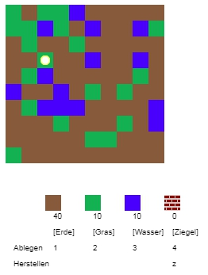
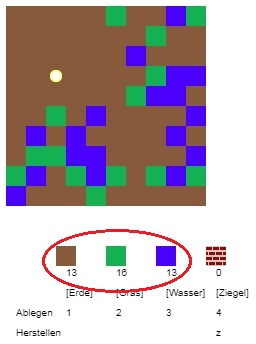
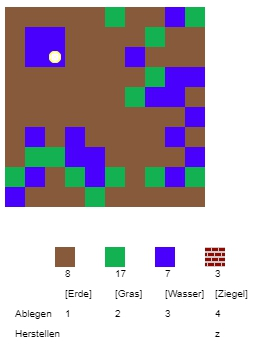
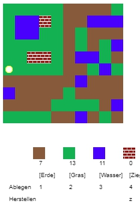
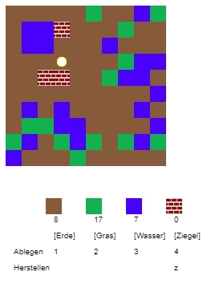

## Das Spiel spielen

+ Öffne dieses trinket [rpf.io/codecraft-on](https://rpf.io/codecraft-on){:target="_blank"}.

+ Benutze die Tasten W, A, S und D, um deinen Spieler in der Welt, die voll mit verschiedenen Ressourcen ist (Erde, Gras und Wasser), umher zu bewegen.
    
    

+ Du kannst die Leertaste drücken, um Ressourcen zu sammeln. Nimm ein paar Stück von jeder Ressource und du wirst sehen, wie sie zu deinem Inventar hinzugefügt werden.
    
    

+ Drücke die Zifferntasten (1 bis 3), um eine Ressource auf der Karte zu platzieren. Du musst zum Beispiel die 3 drücken um etwas Wasser auf der Karte platzieren. Dies funktioniert nur, wenn du etwas Wasser in deinem Inventar hast.
    
    

+ Du kannst einen Gegenstand herstellen, indem du die im Menü angezeigte Taste drückst. Herstellen bedeutet, Elemente aus deinem Inventar so zu kombinieren, dass du neue Elemente schaffst. Versuche, die 'z' Taste zu drücken um einen neuen Ziegel herzustellen (sofern du mindestens 2 x Erde und 1 x Wasser in deinem Inventar hast).
    
    

+ Du kannst dann die Taste "4" drücken, um deine fertigen Ziegel ​​zu platzieren.
    
    
