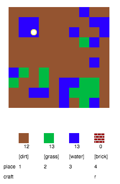
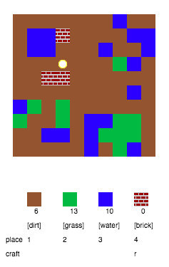

## Das Spiel spielen

+ Dieses Trinket öffnen: <a href="http://jumpto.cc/codecraft-go" target="_blank">jumpto.cc/codecraft-go</a>. 

+ Benutze die WASD-Tasten, um deinen Spieler rund um die Welt zu bewegen, die voller unterschiedlicher Ressourcen (Erde, Gras und Wasser) steckt.

    

+ Du kannst auf die Leertaste klicken, um die Ressourcen einzusammeln. Greife ein paar von all diesen Ressourcen auf und du wirst sehen, dass sie deinem Inventar zugefügt wurden.

    

+ Drücke auf die Zahlentasten (1 bis 3) um eine der Ressourcen auf der Karte zu platzieren. Zum Beispiel kannst du auf die Zahl 3 drücken, um etwas Wasser auf die Karte zu platzieren. Dies funktioniert nur, wenn du etwas Wasser in deinem Inventar besitzt.

    

+ Du kannst einen Gegenstand herstellen, indem du auf die angezeigte Taste im Menü drückst. „Herstellen“ bedeutet die Kombination von Gegenständen, die du bereits in deinem Inventar hast, um einen neuen Gegenstand anzufertigen. Probiere mal auf die 'r' Taste zu drücken, um einen neuen Ziegelstein anzufertigen (das funktioniert nur, sofern du 2 x Erde und 1 x Wasser in deinem Inventar hast).

    

+ Du kannst dann die Taste mit der Zahl '4'  drücken, um deine hergestellten Ziegelsteine zu platzieren.

    

