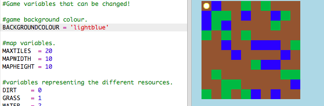

## Du kannst dein Spiel persönlicher gestalten

Lass uns einige der Variablen ändern, um die Funktionsweise des Spiels zu ändern.

+ Klicke auf die Datei `variables.py`, um einige der Variablen zu sehen, die geändert werden können.
    
    

+ Ändere den Wert der Variable `HINTERGRUNDFARBE` und klicke auf 'Run' (Ausführen), um die Änderung in deinem Spiel zu sehen.
    
    

+ Die Variable `MAXELEMENTE` ist die größte Anzahl jeder Ressource, die in deinem Inventar enthalten sein kann. Ändere diese Variable, wenn du mehr (oder weniger) als 20 Elemente jeder Ressource speichern möchtest.
    
    