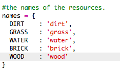
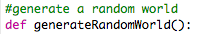
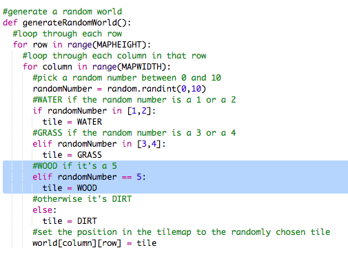

## Eine neue Ressource aus Holz erstellen

Lass uns eine neue Ressource aus Holz erstellen. Damit du dies tun kannst, musst du manche Variablen in deine `variables.py` Datei hinzufügen.

+ Als erstes musst du deiner neuen Ressource eine Zahl geben. Du kannst dann das Wort `WOOD` (Holz) in deinen Code eingeben statt der Zahl 4.

    

+ Du solltest deine neue `WOOD` (Holz) Ressource zu deiner Liste an `resources` (Ressourcen) hinzufügen.

    

+ Du solltest deiner Ressource einen Namen geben, der dann in der Inventarliste aufgeführt wird.

    

    Achte auf das Komma `,` am Ende der obigen Zeile!

+ Deine Ressource benötigt auch ein Bild. Das Projekt beinhaltet bereits ein Bild namens `wood.png`, (Holz), das du zu deinem `textures` (Strukturen) Wörterbuch hinzufügen solltest.

    

+ Füge die Anzahl deiner Ressourcen hinzu, welche sich von Beginn an in deinem `inventory` (Inventar) befinden sollten.

    

+ Abschließend musst du die Taste hinzufügen, die gedrückt werden soll, um das Holz in deiner Welt platzieren zu können. 

    

+ Lasse dein Projekt laufen, um es zu testen. Du wirst jetzt sehen, dass du eine neue 'wood' (Holz) Ressource in deinem Inventar hast.

    

+ Es gibt kein Holz in deiner Welt! Um dieses Problem zu behen, klicke auf die `main.py` (Haupt-) Datei und finde die Funktion namens `generateRandomWorld()` (zufällige Welt generieren).

        

    Dieser Code generiert eine Zufallszahl zwischen 0 und 10 und benutzt diese Zahl, um zu entscheiden, welche Ressource platziert werden soll:

    + 1 oder 2 = Wasser
    + 3 oder 4 = Gras
    + alle anderen Zahlen = ERDE

+ Füge diesen Code hinzu, um das Holz zu deiner Welt hinzuzufügen, wannimmer die `randomNumber` (Zufallszahl) die Nummer 5 ist.

    

+ Teste dein Projekt erneut. Dieses Mal solltest du sehen können, dass das Holz jetzt in deiner Welt erscheint.

    

