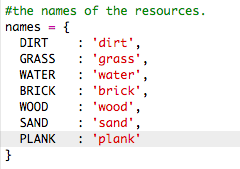
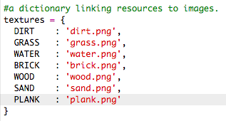
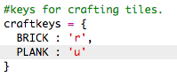

## Latten aus Holz herstellen

Lass uns eine neue Latten-Ressource herstellen, welche aus Holz hergestellt wird.

+ Als erstes musst du eine neue `PLANK` (Holzlatte) Variable deinem Spiel hinzufügen.

    

+ Füge eine neue `PLANK` (Holzlatte) Variable zu deinem Spiel hinzu.

    

+ Nenne diese Ressource `'plank'` (Holzlatte).

    

+ Füge deiner `PLANK` (Holzlatte) Ressource ein Bild hinzu. Das Projekt enthält bereits ein `plank.png` (Holzlatte) Bild, aber du kannst dein eigenes Bild herstellen, wenn du willst.

    

+ Füge die Holzlatten zu deinem Inventar hinzu.

    

+ Richte eine Taste ein, um die Holzlatten zu platzieren.

    

+ Da diese Ressource angefertigt werden muss, musst du eine Herstellungsregel kreieren, welche daraus besteht, dass eine Holzlatte aus 3 Holzstücken angefertigt werden muss. Füge diesen Code zu deinem `crafting` (Anfertigung) Wörterbuch hinzu. 

    

+ Abschließend musst du eine Taste zur Anfertigung neuer Holzlatten einrichten.

    

+ Um deine neue Holzlatte-Ressource zu testen, kannst du ein paar Holzstücke sammeln und dann ein paar Holzlatten aus deinem Holz anfertigen. Du kannst dann die neuen Holzlatten in deiner Welt platzieren.

    

