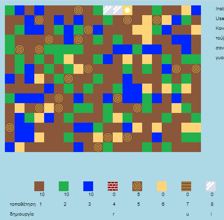

## Εισαγωγή

Σε αυτό το έργο, θα σχεδιάσεις και θα γράψεις κώδικα για βελτιώσεις σε μια δισδιάστατη εκδοχή του Minecraft.

  <iframe src="https://trinket.io/embed/python/9678f16b78?outputOnly=true&start=result" width="600" height="500" frameborder="0" marginwidth="0" marginheight="0" allowfullscreen>
  </iframe>
  

### Πρόσθετες πληροφορίες για τους συντονιστές των ομάδων

Αν χρειαστεί να εκτυπώσεις αυτό το έργο, χρησιμοποίησε την [εκτυπώσιμη έκδοση](https://projects.raspberrypi.org/el-GR/projects/codecraft/print).

--- collapse ---
---
title: Σημειώσεις συντονιστή ομάδας
---

## Εισαγωγή:

Σε αυτό το έργο, τα παιδιά θα μάθουν πτυχές του σχεδιασμού γραφικών και παιχνιδιών, κάνοντας βελτιώσεις σε μία δισδιάστατη εκδοχή του Minecraft. Τα παιδιά θα δημιουργήσουν νέους πόρους, καθώς και κανόνες για το συνδυασμό πόρων με σκοπό τη δημιουργία νέων. Αυτό θα γίνει εφικτό με την κατανόηση και την χρήση μεταβλητών, λιστών και λεξικών (dictionaries).

## Online Πόροι

**Αυτό το έργο χρησιμοποιεί Python 3.** Συνιστούμε να χρησιμοποιήσετε το [trinket](https://trinket.io/) για να γράψετε Python online. Το έργο αυτό περιλαμβάνει τα ακόλουθα Trinkets:

+ [Το σημείο στο οποίο ξεκινάει το μάθημα του CodeCraft - rpf.io/codecraft-on](https://rpf.io/codecraft-on)

Υπάρχει επίσης ένα trinket που περιέχει το ολοκληρωμένο έργο:

+ ['CodeCraft' ολοκληρώθηκε - trinket.io/python/ebc5b0148b](https://trinket.io/python/9678f16b78)

## Offline Πόροι

Το έργο αυτό μπορεί να [ολοκληρωθεί χωρίς σύνδεση](https://www.codeclubprojects.org/en-GB/resources/python-working-offline/) αν προτιμάς. Μπορείς να αποκτήσεις πρόσβαση στους πόρους του έργου κάνοντας κλικ στο σύνδεσμο «Υλικό έργου» για αυτό το έργο. Αυτός ο σύνδεσμος περιέχει μια ενότητα "Πόροι έργου", η οποία περιλαμβάνει πόρους που τα παιδιά θα χρειαστούν για να ολοκληρώσουν αυτό το έργο εκτός σύνδεσης. Βεβαιωθείτε ότι κάθε παιδί έχει πρόσβαση σε ένα αντίγραφο αυτών των πόρων. Αυτή η ενότητα περιλαμβάνει τα ακόλουθα αρχεία:

+ codecraft/codecraft.py
+ codecraft/variables.py
+ codecraft/brick.gif
+ codecraft/dirt.gif
+ codecraft/glass.gif
+ codecraft/grass.gif
+ codecraft/plank.gif
+ codecraft/player.gif
+ codecraft/sand.gif
+ codecraft/water.gif
+ codecraft/wood.gif

Μπορείς επίσης να βρεις μια ολοκληρωμένη έκδοση αυτού του έργου στην ενότητα «Πόροι εθελοντών», η οποία περιέχει:

+ codecraft-finished/codecraft.py
+ codecraft-finished/variables.py
+ codecraft-finished/brick.gif
+ codecraft-finished/dirt.gif
+ codecraft-finished/glass.gif
+ codecraft-finished/grass.gif
+ codecraft-finished/plank.gif
+ codecraft-finished/player.gif
+ codecraft-finished/sand.gif
+ codecraft-finished/water.gif
+ codecraft-finished/wood.gif

(Όλοι οι παραπάνω πόροι μπορούν επίσης να κατέβουν ως συμπιεσμένα `.zip` αρχεία.)

## Στόχοι μάθησης

+ Δημιουργία και επεξεργασία γραφικών
+ Σχεδίαση παιχνιδιών
+ Επεξεργασία: 
    + Μεταβλητές
    + Λίστες
    + Λεξικά.

Αυτό το έργο καλύπτει στοιχεία από τις ακόλουθες πτυχές του [Προγράμματος Μαθημάτων Ψηφιακής Δημιουργίας του Raspberry Pi](https://rpf.io/curriculum):

+ [Σχεδιασμός βασικών στοιχείων 2D και 3D.](https://www.raspberrypi.org/curriculum/design/creator)

+ [Συνδύασε δομές προγραμματισμού για να λύσεις ένα πρόβλημα.](https://www.raspberrypi.org/curriculum/programming/builder)

## Προκλήσεις

+ "Χτίσε τον κόσμο σου" - Παίζοντας το παιχνίδι, τοποθετώντας και κατασκευάζοντας τα υπάρχοντα μπλοκ.
+ "Αλλαγή του μεγέθους του κόσμου" - επεξεργασία των μεταβλητών `MAPWIDTH` και `MAPHEIGHT` για να αλλάξεις το μέγεθος του κόσμου.
+ "Δημιουργία άμμου" - Δημιουργία νέο πόρου άμμου, όπως και των σχετικών δεδομένων παιχνιδιού.
+ "Δημιουργία γυαλιού από την άμμο" - Δημιουργία ενός νέου πόρου γυαλιού.
+ "Δημιούργησε περισσότερους πόρους" - Χρησιμοποίησε όσα έμαθες για να δημιουργήσεις περισσότερα μπλοκ και κανόνες δημιουργίας.

## Συχνές Ερωτήσεις

+ Ίσως χρειαστεί να υπενθυμίσετε στα παιδιά ότι τα στοιχεία ενός λεξικού ή μιας λίστας διαχωρίζονται με κόμμα. Για παράδειγμα, κατά την προσθήκη αντικειμένων, γραφικών και κανόνων δημιουργίας στο παιχνίδι.

--- /collapse ---

--- collapse ---
---
title: Υλικό έργου
---

## Πόροι έργου

+ [αρχείο .zip που περιέχει όλους τους πόρους του έργου](resources/codecraft-resources.zip)
+ [Online Trinket που περιέχει όλους τους πόρους του έργου "CodeCraft"](https://rpf.io/codecraft-on)

## Πόροι συντονιστή ομάδας

+ [Αρχείο .zip που περιέχει όλους τους πόρους του έργου](solutions/codecraft-solution.zip)
+ [Online ολοκληρωμένο έργο Trinket](https://trinket.io/python/9678f16b78)

--- /collapse ---
