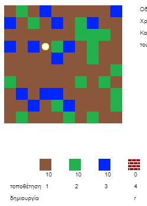
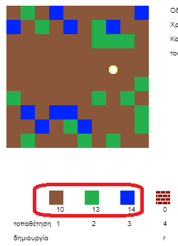
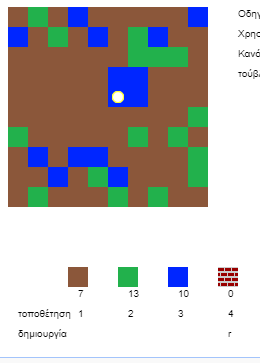
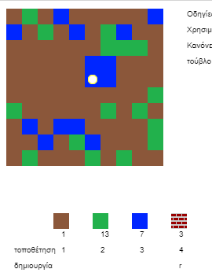
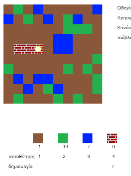

## Παίζοντας το παιχνίδι

+ Άνοιξε αυτό το πρότυπο trinket: [rpf.io/codecraft-on](https://rpf.io/codecraft-on){:target="_blank"}.

+ Χρησιμοποίησε τα πλήκτρα WASD για να μετακινήσεις τον παίκτη σου σε όλο τον κόσμο, ο οποίος είναι γεμάτος από διαφορετικούς πόρους (λάσπη, χόρτο και νερό).
    
    

+ Μπορείς να πατήσεις το space για να συλλέξεις πόρους. Πάρε μερικούς πόρους από κάθε είδος και θα τα δεις να προστίθενται στο απόθεμά σου.
    
    

+ Πάτησε τα πλήκτρα 1 έως 3 για να τοποθετήσεις έναν πόρο στο χάρτη. Για παράδειγμα, πάτησε 3 για να τοποθετήσεις λίγο νερό στο χάρτη. Αυτό θα λειτουργήσει μόνο εάν έχεις νερό στο απόθεμά σου.
    
    

+ Μπορείς να δημιουργήσεις ένα αντικείμενο πατώντας το πλήκτρο που εμφανίζεται στο μενού. Δημιουργία σημαίνει να συνδυάσεις αντικείμενα που έχεις ήδη στο απόθεμά σου για να κατασκευάσεις νέα. Δοκίμασε να πατήσεις το πλήκτρο 'r' για να δημιουργήσεις ένα νέο τούβλο (εφ 'όσον έχεις 2 λάσπες και 1 νερό στο απόθεμά σου).
    
    

+ Στη συνέχεια, πίεσε το πλήκτρο '4' για να τοποθετήσεις τα κατασκευασμένα τούβλα σου.
    
    
