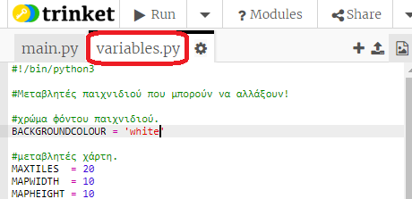
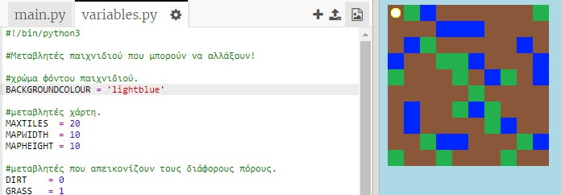
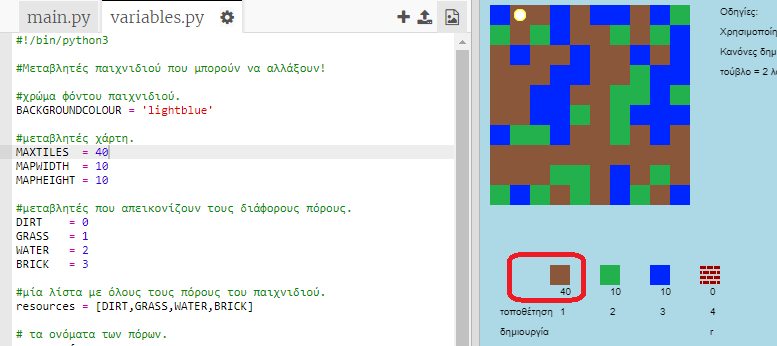

## Προσαρμογή του παιχνιδιού σου

Ας τροποποιήσουμε ορισμένες μεταβλητές για να αλλάξουμε τον τρόπο με τον οποίο λειτουργεί το παιχνίδι σου.

+ Κάνε κλικ στο αρχείο `variables.py` για να δεις μερικές μεταβλητές που μπορούν να αλλάξουν.
    
    

+ Άλλαξε την τιμή της μεταβλητής `BACKGROUNDCOLOUR` και κάνε κλικ στο 'Run' για να δεις την αλλαγή στο παιχνίδι σου.
    
    

+ Η μεταβλητή `MAXTILES` είναι η ποσότητα κάθε πόρου που μπορεί να διατηρηθεί στο απόθεμά σου. Άλλαξε αυτήν τη μεταβλητή αν θέλεις να αποθηκεύσεις περισσότερα (ή λιγότερα) από 20 μονάδες από κάθε πόρο.
    
    