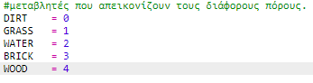
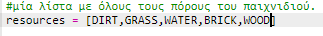
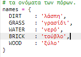
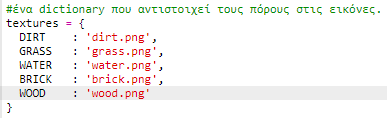
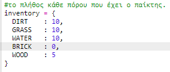
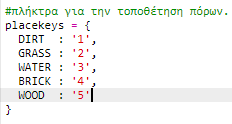
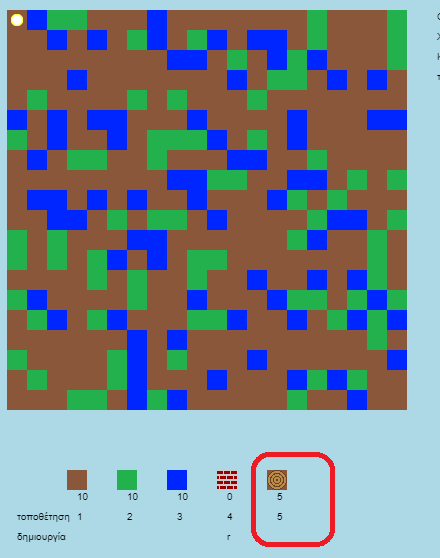
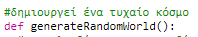
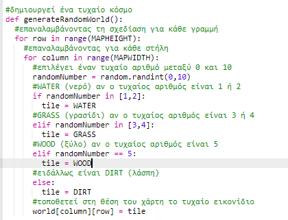
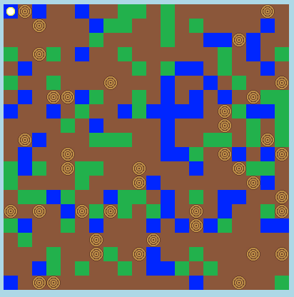

## Δημιουργία νέου πόρου ξυλείας

Ας δημιουργήσουμε ένα νέο πόρο ξύλου. Για να το κάνεις αυτό, θα πρέπει να προσθέσεις ορισμένες μεταβλητές στο αρχείο `variables.py`.

+ Πρώτον, πρέπει να δώσεις στον νέο σου πόρο ένα νούμερο. Στη συνέχεια, θα μπορείς να χρησιμοποιείς τη λέξη `WOOD` στον κώδικά σου αντί για τον αριθμό 4.
    
    

+ Θα πρέπει να προσθέσεις τον νέο σου πόρο `WOOD` στη λίστα των `πόρων σου`.
    
    

+ Θα πρέπει επίσης να δώσεις στον πόρο σου ένα όνομα, το οποίο θα εμφανίζεται στο απόθεμα.
    
    
    
    Παρατήρησε το κόμμα `,` στο τέλος της παραπάνω γραμμής.

+ Ο πόρος σου θα χρειαστεί επίσης μια εικόνα. The project already includes an image called `wood.gif`, which you should add to the `textures` dictionary.
    
    

+ Πρόσθεσε τον αριθμό των πόρων που θα βρίσκονται στο `απόθεμά` σου στην αρχή του παιχνιδιού.
    
    

+ Τέλος, πρόσθεσε το πλήκτρο που θα πατάς για να τοποθετείς ξύλο στον κόσμο.
    
    

+ Τρέξε το έργο σου για να το δοκιμάσεις. Θα δεις ότι έχεις τώρα έναν νέο πόρο ξυλείας στο απόθεμά σου.
    
    

+ Δεν υπάρχει ξύλο στον κόσμο σου! Για να το διορθώσεις, κάνε κλικ στο αρχείο `main.py` και βρες τη συνάρτηση που ονομάζεται `generateRandomWorld()`.
    
    
    
    Αυτός ο κώδικας δημιουργεί έναν τυχαίο αριθμό μεταξύ 0 και 10 και χρησιμοποιεί τον αριθμό για να αποφασίσει ποιος πόρος πρέπει να τοποθετηθεί:
    
    + 1 ή 2 = νερό
    + 3 ή 4 = γρασίδι
    + οτιδήποτε άλλο = λάσπη

+ Πρόσθεσε αυτόν τον κώδικα για να προσθέτεις ξύλο στον κόσμο σου κάθε φορά που το `randomNumber` είναι 5.
    
    

+ Δοκίμασε ξανά το έργο σου. Αυτή τη φορά, θα πρέπει να δεις λίγο ξύλο να εμφανίζεται στον κόσμο σου.
    
    