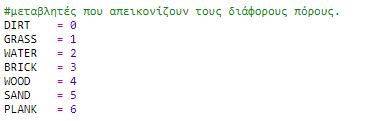
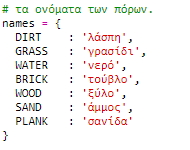
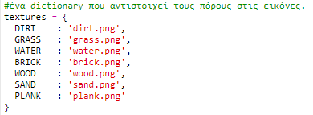
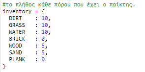
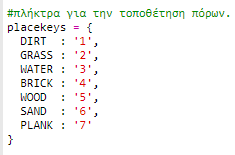
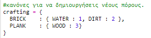
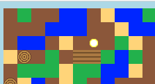

## Κατασκευή ξύλινων σανίδων

Ας δημιουργήσουμε μια νέα σανίδα που θα κατασκευαστεί από ξύλο.

+ Αρχικά, πρόσθεσε μια νέα μεταβλητή `PLANK` στο παιχνίδι σου.
    
    

+ Πρόσθεσε μια νέα μεταβλητή `PLANK` στο παιχνίδι σου.
    
    

+ Ονόμασε τον πόρο `'plank'`.
    
    

+ Δώσε στον πόρο `PLANK` μια εικόνα. The project already contains a `plank.gif` image, but you can create your own if you prefer.
    
    

+ Πρόσθεσε σανίδες στο απόθεμά σου.
    
    

+ Όρισε ένα πλήκτρο για την τοποθέτηση σανίδων.
    
    

+ Καθώς αυτός ο πόρος μπορεί να δημιουργηθεί, πρέπει να δημιουργήσεις έναν κανόνα κατασκευής, ώστε μια σανίδα να μπορεί να κατασκευαστεί από 3 ξύλα. Πρόσθεσε αυτόν τον κώδικα στο λεξικό `crafting`.
    
    

+ Τέλος, πρέπει να ορίσεις ένα πλήκτρο για τη δημιουργία νέων σανίδων.
    
    

+ Για να δοκιμάσεις τη νέα σου σανίδα, συγκέντρωσε μερικά ξύλα και στη συνέχεια δημιούργησε μερικές ξύλινες σανίδες από αυτά. Στη συνέχεια, μπορείς να τοποθετήσεις τις νέες σανίδες σου στον κόσμο σου.
    
    