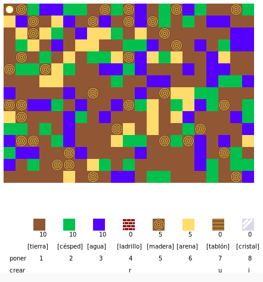

## Introducción

En este proyecto, diseñarás y codificarás mejoras en una versión 2D de Minecraft.

  <iframe src="https://trinket.io/embed/python/ba085f0bd2?outputOnly=true&start=result" width="600" height="500" frameborder="0" marginwidth="0" marginheight="0" allowfullscreen></iframe>
  

### Información adicional para los líderes del club

Si necesitas imprimir este proyecto, usa la [versión para imprimir](https://projects.raspberrypi.org/es-ES/projects/codecraft/print).

--- collapse ---
---
title: Notas del líder del club
---
## Introducción:

En este proyecto, los niños aprenderán aspectos de diseño gráfico y de juegos al realizar mejoras en un clon básico de Minecraft en 2D. Los niños crearán nuevos recursos, así como reglas para combinar recursos para crear otros nuevos. Esto se logrará mediante la comprensión y manipulación de variables, listas y diccionarios.

## Recursos en línea

**Este proyecto usa Python 3.** Recomendamos el uso de [trinket](https://trinket.io/) para escribir Python en línea. Este proyecto contiene los Trinkets siguientes:

+ [Punto de partida de 'Creación de códigos' -- jumpto.cc/codecraft-go](https://trinket.io/python/c3877b95d4)

También hay un Trinket que contiene el proyecto completo:

+ [‘Creación de códigos’ terminada -- trinket.io/python/ba085f0bd2](https://trinket.io/python/ba085f0bd2)

## Recursos sin conexión

Este proyecto se puede [completar sin conexión](https://www.codeclubprojects.org/en-GB/resources/python-working-offline/) si se prefiere. Se puede acceder a los recursos del proyecto haciendo clic en el enlace 'Materiales del proyecto' para este proyecto. Este enlace contiene una sección de 'Recursos del proyecto', que incluye los recursos que los niños necesitarán para completar este proyecto sin conexión. Asegúrese de que cada niño tenga acceso a una copia de estos recursos. Esta sección incluye los siguientes archivos:

+ codecraft/codecraft.py
+ codecraft/variables.py
+ codecraft/player.gif
+ codecraft/dirt.gif
+ codecraft/grass.gif
+ codecraft/water.gif
+ codecraft/brick.gif

También se puede encontrar una versión completa de este proyecto en la sección 'Recursos para voluntarios', que contiene:

+ codecraft-finished/codecraft.py
+ codecraft-finished/variables.py
+ codecraft-finished/player.gif
+ codecraft-finished/dirt.gif
+ codecraft-finished/grass.gif
+ codecraft-finished/water.gif
+ codecraft-finished/brick.gif
+ codecraft-finished/wood.gif
+ codecraft-finished/plank.gif

(Todos los recursos anteriores también se pueden descargar como archivos `.zip` de proyectos y voluntarios.)

## Objetivos del Aprendizaje

+ Crear y editar gráficos;
+ Diseño de Juegos
+ Edición: 
    + Variables;
    + Listas;
    + Diccionarios.

Este proyecto incluye elementos de los siguientes aspectos del [currículo de digitalización de Raspberry Pi](https://rpf.io/curriculum):

+ [Diseña elementos básicos en 2D y 3D.](https://www.raspberrypi.org/curriculum/design/creator)

+ [Combina construcciones de programación para resolver un problema.](https://www.raspberrypi.org/curriculum/programming/builder)

## Retos

+ "Construye tu mundo": juega, poniendo y creando bloques existentes;
+ "Cambia el tamaño de tu mundo" - editar las variables `MAPWIDTH` y `MAPHEIGHT` para cambiar el tamaño del mundo;
+ "Crear arena" - Crear un nuevo recurso de arena, junto con datos de juego asociados.
+ "Crea cristal a partir de arena" - Crear un nuevo recurso de cristal.
+ "Crear más recursos": usa lo que se ha aprendido para crear más bloques y reglas de creación.

## Preguntas frecuentes

+ **Python sin conexión no funciona con imágenes .png. Las imagenes .gif se han suministrado para su uso sin conexión.**
+ Es posible que se necesite recordar a los niños que los elementos de un diccionario / lista están separados por una coma. Por ejemplo, cuando se añaden artículos del inventario, gráficos y reglas de creación al juego.

--- /collapse ---

--- collapse ---
---
title: Materiales del proyecto
---
## Recursos del proyecto

+ [archivo .zip que contiene todos los recursos del proyecto](resources/codecraft-project-resources.zip)
+ [Trinket en línea que contiene todos los recursos del proyecto 'Creación de códigos'](https://trinket.io/python/c3877b95d4)
+ [codecraft/codecraft.py](resources/codecraft-codecraft.py)
+ [codecraft/variables.py](resources/codecraft-variables.py)
+ [codecraft/brick.gif](resources/codecraft-brick.gif)
+ [codecraft/dirt.gif](resources/codecraft-dirt.gif)
+ [codecraft/glass.gif](resources/codecraft-glass.gif)
+ [codecraft/grass.gif](resources/codecraft-grass.gif)
+ [codecraft/plank.gif](resources/codecraft-plank.gif)
+ [codecraft/player.gif](resources/codecraft-player.gif)
+ [codecraft/sand.gif](resources/codecraft-sand.gif)
+ [codecraft/water.gif](resources/codecraft-water.gif)
+ [codecraft/wood.gif](resources/codecraft-wood.gif)

## Recursos del líder del club

+ [archivo .zip que contiene todos los recursos del proyecto](resources/codecraft-volunteer-resources.zip)
+ [Proyecto Trinket completado en línea](https://trinket.io/python/ba085f0bd2)
+ [codecraft-finished/codecraft.py](resources/codecraft-finished-codecraft.py)
+ [codecraft-finished/variables.py](resources/codecraft-finished-variables.py)
+ [codecraft-finished/brick.gif](resources/codecraft-finished-brick.gif)
+ [codecraft-finished/dirt.gif](resources/codecraft-finished-dirt.gif)
+ [codecraft-finished/glass.gif](resources/codecraft-finished-glass.gif)
+ [codecraft-finished/grass.gif](resources/codecraft-finished-grass.gif)
+ [codecraft-finished/plank.gif](resources/codecraft-finished-plank.gif)
+ [codecraft-finished/player.gif](resources/codecraft-finished-player.gif)
+ [codecraft-finished/sand.gif](resources/codecraft-finished-sand.gif)
+ [codecraft-finished/water.gif](resources/codecraft-finished-water.gif)
+ [codecraft-finished/wood.gif](resources/codecraft-finished-wood.gif)

--- /collapse ---
