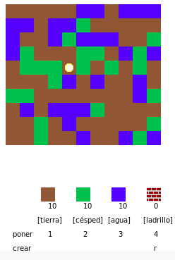
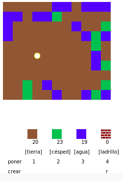
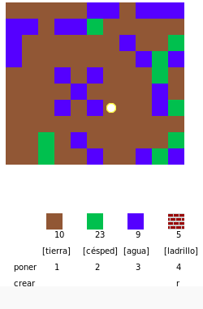
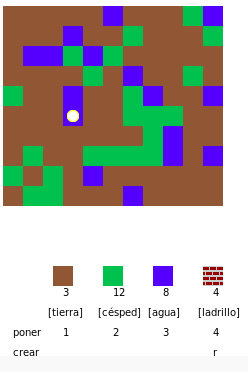
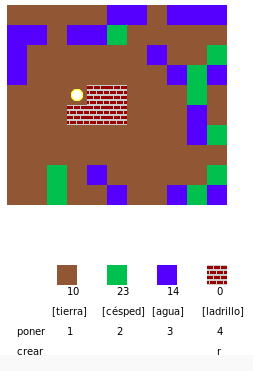

## Jugar el juego

+ Abre este Trinket: <a href="https://trinket.io/python/c3877b95d4" target="_blank">jumpto.cc/codecraft-go</a>.

+ Usa las teclas WASD para mover tu jugador por todo el mundo, que está lleno de diferentes recursos (tierra, césped y agua).
    
    

+ Puedes presionar el espacio para recoger recursos. Recoge algunos de cada tipo de recurso, y verás que se añaden a tu inventario.
    
    

+ Haz clic en las teclas numéricas (1 a 3) para poner un recurso en el mapa. Por ejemplo, haz clic en 3 para poner el agua en el mapa. Esto solo funcionará si tienes algo de agua en tu inventario.
    
    

+ Puedes crear un elemento presionando la tecla que se muestra en el menú. La creación significa combinar elementos que ya tienes en tu inventario para crear otros nuevos. Intenta presionar la tecla 'r' para crear un ladrillo nuevo (siempre que tengas 2 tierra y 1 agua en tu inventario).
    
    

+ A continuación, puedes presionar la tecla '4' para poner los ladrillos que has creado.
    
    