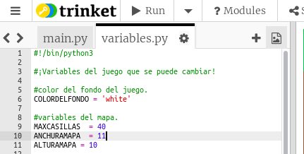
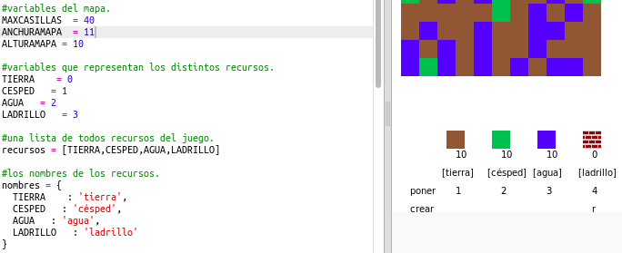

## Personalizar tu juego

Modifiquemos algunas variables para cambiar el modo en el que el juego funciona.

+ Haz clic en el archivo `variables.py` para ver algunas de las variables que puedes modificar.

    

+ Cambia el valor de la variable `BACKGROUNDCOLOUR` y haz clic en 'Run' para ver el cambio en el juego.

    

+ La variable `MAXTILES` es la cantidad de cada recurso que puedes guardar en tu inventario. Cambia esta variable si deseas guardar más (o menos) de 20 unidades por recurso.

    

