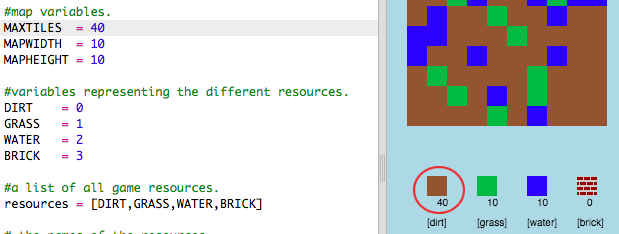

## Personalizar tu juego

Modifiquemos algunas variables para cambiar el funcionamiento de tu juego.

+ Haz clic en el archivo `variables.py` para ver algunas variables que se pueden cambiar.
    
    

+ Cambia el valor de tu variable `BACKGROUNDCOLOUR`, y haz clic en 'Run' para ver el cambio en tu juego.
    
    

+ La variable `MAXTILES` es la cantidad de cada recurso que puede mantenerse en tu inventario. Cambia esta variable si quieres almacenar más (o menos) que 20 de cada recurso.
    
    