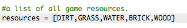
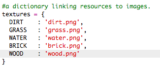
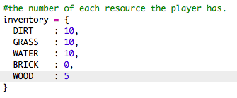

## Creación de un nuevo recurso: madera

Creemos el recurso "madera". Para ello, necesitarás añadir algunas variables a tu archivo `variables.py`.

+ Primero, debes proporcionar un número a tu nuevo recurso. A continuación, podrás usar la palabra `WOOD` en tu código en lugar del número 4.

    

+ Debes añadir tu nuevo recurso `WOOD` a la lista `resources`.

    

+ También debes proporcionar a tu recurso un nombre que será visualizado en el inventario.

    

    Ten en cuenta la coma `,` al final de la línea anterior.

+ Tu recurso también necesitará una imagen. El proyecto ya incluye una imagen con el nombre `wood.png` que deberás añadir al diccionario `textures`.

    

+ Añade el número de recursos de este tipo que tendrás en tu `inventory` al inicio.

    

+ Por último, añade la tecla que deberás pulsar para colocar el recurso en tu mundo. 

    

+ Ejecuta el proyecto para probarlo. Verás que ahora tienes el nuevo recurso 'wood' en tu inventario.

    

+ ¡No hay madera en tu mundo! Para solucionarlo, haz clic en el archivo `main.py` y localiza la función `generateRandomWorld()`.

        

    Este código genera un número aleatorio entre 0 y 10 y usa el número para decidir qué recurso colocar:

    + 1 o 2 = agua
    + 3 o 4 = césped
    + cualquier otro = SUCIEDAD

+ Agrega este código para añadir madera a tu mundo cada vez que `randomNumber` sea 5. 

    

+ Vuelve a probar tu proyecto. Esta vez deberías ver madera en tu mundo.

    

