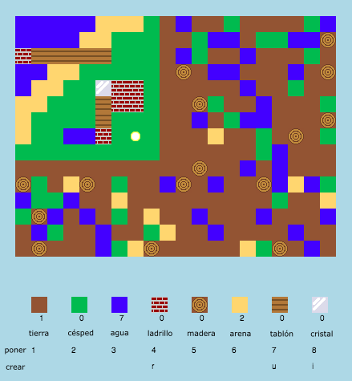

## Introducción

En este proyecto, diseñarás y codificarás mejoras a una versión 2D de Minecraft.

  <iframe src="https://trinket.io/embed/python/45632f87fd?outputOnly=true&start=result" width="600" height="500" frameborder="0" marginwidth="0" marginheight="0" allowfullscreen>
  </iframe>
  

### Información adicional para los líderes del club

Si necesitas imprimir este proyecto, por favor usa la [versión para imprimir](https://projects.raspberrypi.org/es-LA/projects/codecraft/print).

--- collapse ---
---
title: Notas para el líder del club
---

## Introducción:

En este proyecto, los niños aprenderán aspectos de gráficos y diseño de juegos haciendo mejoras a un clon básico de Minecraft 2D. Los niños crearán nuevos recursos, así como reglas de fabricación para combinar recursos y crear otros nuevos. Esto se logrará mediante la comprensión y manipulación de variables, listas y diccionarios.

## Recursos en línea

**Este proyecto utiliza Python 3.** Recomendamos usar [trinket](https://trinket.io/) para escribir Python en línea. Este proyecto contiene las siguientes Trinkets:

+ [Proyecto de inicio 'CodeCraft' - trinket.io/python/c82f32a12f](https://trinket.io/python/c82f32a12f)

También hay un Trinket que contiene el proyecto completo:

+ [‘CodeCraft’ Terminado -- trinket.io/python/45632f87fd](https://trinket.io/python/45632f87fd)

## Recursos sin conexión

Este proyecto se puede [completar sin conexión](https://www.codeclubprojects.org/en-GB/resources/python-working-offline/) si se prefiere. Puedes acceder a los recursos del proyecto haciendo clic en el enlace 'Materiales del proyecto' para este proyecto. Este enlace contiene una sección de "Recursos del proyecto", que incluye recursos que los niños necesitarán para completar el proyecto sin conexión. Asegúrate que cada niño tenga acceso a una copia de estos recursos. Esta sección incluye los siguientes archivos:

+ codecraft/codecraft.py
+ codecraft/variables.py
+ codecraft/brick.gif
+ codecraft/dirt.gif
+ codecraft/glass.gif
+ codecraft/grass.gif
+ codecraft/plank.gif
+ codecraft/player.gif
+ codecraft/sand.gif
+ codecraft/water.gif
+ codecraft/wood.gif

También puedes encontrar una versión completa de este proyecto en la sección 'Recursos para voluntarios', que contiene:

+ codecraft-finished/codecraft.py
+ codecraft-finished/variables.py
+ codecraft-finished/brick.gif
+ codecraft-finished/dirt.gif
+ codecraft-finished/glass.gif
+ codecraft-finished/grass.gif
+ codecraft-finished/plank.gif
+ codecraft-finished/player.gif
+ codecraft-finished/sand.gif
+ codecraft-finished/water.gif
+ codecraft-finished/wood.gif

(Todos los recursos anteriores también se pueden descargar como archivos `.zip`)

## Objetivos del Aprendizaje

+ Creación y edición de gráficos;
+ Diseño de juego;
+ Edición: 
    + Variables;
    + Listas;
    + Diccionarios.

Este proyecto incluye elementos de los siguientes aspectos del [Currículo de creación digital de Raspberry Pi](https://rpf.io/curriculum):

+ [Diseño de elementos básicos en 2D y 3D.](https://www.raspberrypi.org/curriculum/design/creator)

+ [Combinación de estructuras de programación para resolver un problema.](https://www.raspberrypi.org/curriculum/programming/builder)

## Desafíos

+ "Construir tu mundo"- Jugar el juego, colocar y crear bloques existentes
+ "Cambiar el tamaño de tu mundo" - Editar las variables `ANCHOMAPA` y `ALTURAMAPA` para cambiar el tamaño del mundo;
+ "Crear arena" - Crear un nuevo recurso de arena, junto con los datos asociados al juego.
+ "Crear cristal a partir de arena" - Crear un nuevo recurso de cristal.
+ "Crear más recursos" - Usar lo que se ha aprendido para crear más bloques y reglas de creación.

## Preguntas frecuentes

+ Es posible que se necesite recordar a los niños que los elementos de un diccionario / lista están separados por una coma. Por ejemplo, cuando se añaden artículos de inventario, gráficos y reglas de creación al juego.

--- /collapse ---

--- collapse ---
---
title: Materiales del proyecto
---

## Recursos del proyecto

+ [archivo .zip que contiene todos los recursos del proyecto](https://rpf.io/p/es-LA/codecraft-go)
+ [Trinket en línea que contiene todos los recursos del proyecto 'CodeCraft'](https://trinket.io/python/c82f32a12f)

## Recursos del líder del club

+ [archivo .zip que contiene todos los recursos del proyecto](https://rpf.io/p/es-LA/codecraft-get)
+ [Proyecto Trinket completado en línea](https://trinket.io/python/45632f87fd)

--- /collapse ---
