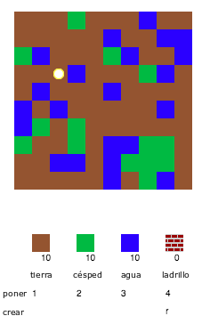
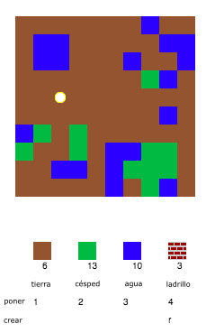
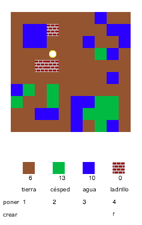

## Jugar el juego

+ Abre este trinket: [rpf.io/codecraft-on](http://rpf.io/codecraft-on){:target="_blank"}.

+ Usa las teclas WASD para mover a tu jugador alrededor del mundo, que está lleno de diferentes recursos (tierra, césped y agua).
    
    

+ Puedes presionar la barra espaciadora para recolectar recursos. Recoge algunos de cada tipo de recurso, y verás que se añaden a tu inventario.
    
    

+ Haz clic en las teclas numéricas (1 a 3) para poner un recurso en el mapa. Por ejemplo, haz clic en el 3 para poner algo de agua en el mapa. Esto sólo funcionará si tienes algo de agua en tu inventario.
    
    

+ Puedes crear un elemento presionando la tecla que se muestra en el menú. Crear significa combinar objetos que ya tienes en tu inventario para crear otros nuevos. Intenta presionar la tecla 'r' para crear un ladrillo nuevo (siempre que tengas 2 tierra y 1 agua en tu inventario).
    
    

+ Luego, puedes presionar la tecla '4' para colocar los ladrillos que has creado.
    
    