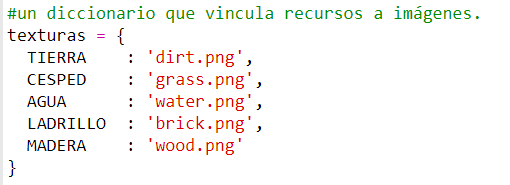
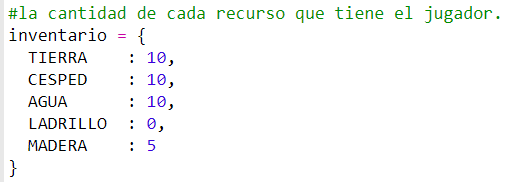
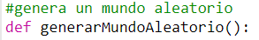
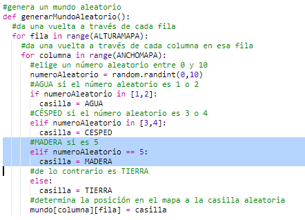

## Creación de un nuevo recurso: madera

Creemos un nuevo recurso de madera. Para hacerlo, necesitarás añadir algunas variables en tu archivo `variables.py`.

+ Primero, necesitas designar un número a tu nuevo recurso. Entonces podrás usar la palabra `MADERA` en tu código en lugar del número 4.
    
    

+ Deberías añadir tu nuevo recurso `MADERA` a tu lista de `recursos`.
    
    

+ También debes darle un nombre a tu recurso que se mostrará en el inventario.
    
    
    
    Observa la coma `,` al final de la línea de arriba.

+ Tu recurso también necesitará una imagen. El proyecto ya incluye una imagen llamada `wood.gif` que debes añadir al `diccionario` de texturas.
    
    

+ Añade el número de tu recurso que debería estar en tu `inventario` para empezar.
    
    

+ Finalmente, añade la tecla que presionarás para poner la madera en el mundo.
    
    

+ Ejecuta tu proyecto para probarlo. Verás que ahora tienes un nuevo recurso de "madera" en tu inventario.
    
    

+ ¡No hay madera en tu mundo! Para solucionar esto, haz clic en tu archivo `main.py` y encuentra la función llamada `generateRandomWorld()`.
    
    
    
    Este código genera un número aleatorio entre 0 al 10 y usa el número para decidir qué recurso poner:
    
    + 1 o 2 = agua
    + 3 o 4 = césped
    + cualquier otro número = TIERRA

+ Añade este código para añadir madera a tu mundo cuando el `numero aleatorio` sea 5.
    
    

+ Prueba tu proyecto de nuevo. Esta vez, deberías ver que la madera aparece en tu mundo.
    
    