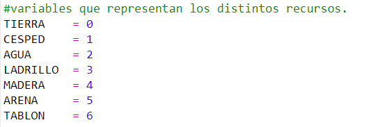
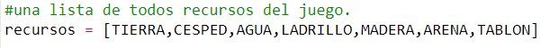
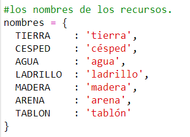
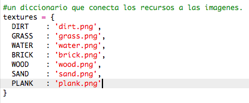
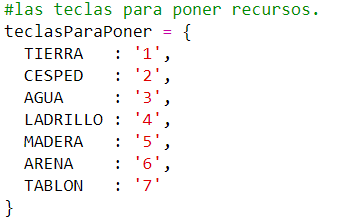
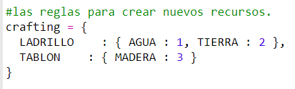
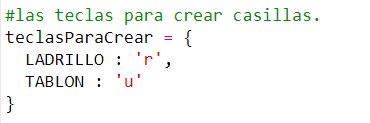

## Crear tablones a partir de madera

Vamos a crear un nuevo recurso: tablón, creado a partir de madera.

+ Primero, añade una nueva variable `TABLON` a tu juego.
    
    

+ Añade una nueva variable `TABLON` a tu juego.
    
    

+ Nombra el recurso `'tablon'`.
    
    

+ Dale a tu recurso `TABLON` una imagen. El proyecto ya contiene una imagen `plank.gif`, pero puedes crear la tuya si lo prefieres.
    
    

+ Añade tablones a tu inventario.
    
    

+ Establece una tecla para poner tablones.
    
    

+ Como este recurso puede ser creado, debes crear una regla de elaboración: que un tablón se puede crear con 3 piezas de madera. Añade este código al diccionario `crafting`.
    
    

+ Finalmente, debes establecer una tecla para crear tablones nuevos.
    
    

+ Para probar tu nuevo recurso de tablón, junta algunas piezas de madera y luego crea algunos tablones de madera. Luego puedes poner tus nuevos tablones en tu mundo.
    
    