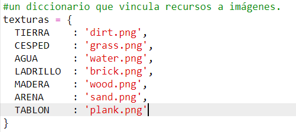
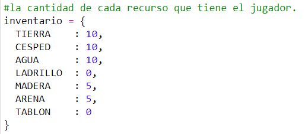

## Elabora tablas de madera

Let's create a new plank resource that be crafted from wood.

+ Primero, añade una nueva variable `PLANK` a tu juego.
    
    

+ Añade una nueva variable `PLANK` a tu juego.
    
    

+ Nombra el recurso `'plank'`.
    
    

+ Dale a tu recurso `PLANK` una imagen. El proyecto ya contiene una imagen `plank.gif`, pero puedes crear la tuya si lo prefieres.
    
    

+ Añade tablas a tu inventario.
    
    

+ Establece una tecla para poner tablas.
    
    

+ Como este recurso puede ser creado, debes crear una regla de elaboración: que una tabla se puede crear con 3 piezas de madera. Añade este código al diccionario de `creacion`.
    
    

+ Finalmente, debes establecer una tecla para crear tablas nuevas.
    
    

+ Para probar tu nuevo recurso de tabla, junta algunas piezas de madera y luego crea algunas tablas de madera. Luego puedes poner tus nuevas tablas en tu mundo.
    
    