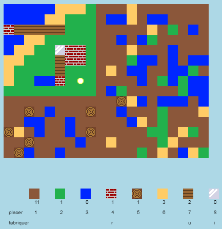

## Introduction

Dans ce projet, tu vas créer et coder des améliorations à une version 2D de Minecraft.

  <iframe src="https://trinket.io/embed/python/ebc5b0148b?outputOnly=true&start=result" width="600" height="500" frameborder="0" marginwidth="0" marginheight="0" allowfullscreen>
  </iframe>
  

### Informations complémentaires pour les responsables de club

Si vous avez besoin d'imprimer ce projet, merci d'utiliser la [Version imprimable](https://projects.raspberrypi.org/en/projects/codecraft/print).

## \--- collapse \---

## title: Notes pour le responsable de club

## Introduction:

Dans ce projet, les enfants apprendront les aspects d'interfaces graphiques et la conception de jeux vidéos en apportant des améliorations à une clone basique de Minecraft en 2D. Les enfants créeront des nouvelles ressources, ainsi que des règles de fabrication qui, en combinant des ressources, en feront de nouvelles. Cela sera réalisé en comprenant et manipulant des variables, des listes et des dictionnaires.

## Ressources en-ligne

**Ce projet utilise Python 3.** Nous recommandons l'utilisation de [Trinket](https://trinket.io/) pour écrire du code Python en-ligne. Ce projet contient les Trinkets suivants :

+ ['CodeCraft' starter project -- rpf.io/codecraft-on](http://rpf.io/codecraft-on)

Il existe aussi ce trinket qui contient le projet complet:

+ [‘CodeCraft’ Finished -- trinket.io/python/ebc5b0148b](https://trinket.io/python/ebc5b0148b)

## Ressources hors-ligne

Ce projet peut être [complété hors-ligne](https://www.codeclubprojects.org/en-GB/resources/python-working-offline/) si désiré. Vous pouvez accéder aux ressources du projet en cliquant sur le lien "Matériel pour le projet". Ce lien contient une section "Ressources du projet" qui inclut les ressources dont les enfants auront besoin pour compléter le projet hors-ligne. Assurez-vous que les enfants ont accès à une copie de ces ressources. Cette section inclut les fichiers suivants :

+ codecraft/codecraft.py
+ codecraft/variables.py
+ codecraft/brick.gif
+ codecraft/dirt.gif
+ codecraft/glass.gif
+ codecraft/grass.gif
+ codecraft/plank.gif
+ codecraft/player.gif
+ codecraft/sand.gif
+ codecraft/water.gif
+ codecraft/wood.gif

Vous pouvez aussi trouver une version complétée du projet dans la section "Ressources du bénévole" qui contient :

+ codecraft-finished/codecraft.py
+ codecraft-finished/variables.py
+ codecraft-finished/brick.gif
+ codecraft-finished/dirt.gif
+ codecraft-finished/glass.gif
+ codecraft-finished/grass.gif
+ codecraft-finished/plank.gif
+ codecraft-finished/player.gif
+ codecraft-finished/sand.gif
+ codecraft-finished/water.gif
+ codecraft-finished/wood.gif

(Toutes les ressources ci-dessus peuvent aussi être téléchargées dans les fichiers`.zip`)

## Objectifs d'apprentissage

+ Créer et éditer des images;
+ Conception de jeux;
+ Modification: 
    + Variables;
    + Listes;
    + Dictionnaires.

Ce projet couvre les élements suivants du [Programme Raspberry Pi de Créativité Numérique](http://rpf.io/curriculum):

+ [Concevoir des éléments basiques en 2D et 3D.](https://www.raspberrypi.org/curriculum/design/creator)

+ [Combiner des constructions de programmation pour résoudre un problème.](https://www.raspberrypi.org/curriculum/programming/builder)

## Challenges

+ "Construis ton monde" - Jouer au jeu, placer et fabriquer des blocs existants
+ "Change la taille de ton monde" - Modifier les variables `LARGEURCARTE` et `HAUTEURCARTE` pour changer les dimensions du monde;
+ "Crée du sable" - Créer un nouvel élément sable, avec les données associées au jeu.
+ "Fabrique du verre à partir de sable" - Créer une nouvelle ressource fabriquée, le verre.
+ "Crée encore plus de ressources" - Utiliser ce qui a été appris pour créer encore plus de blocs et de règles de fabrications.

## Foire aux questions

+ Les enfants peuvent avoir besoin d'un rappel: les éléments dans un dictionnaire/une liste doivent être séparés par des virgules. Par exemple, lorsque l'on ajoute des éléments à l'inventaire, des éléments graphiques ou des règles de fabrications pour le jeu.

\--- /collapse \---

## \--- collapse \---

## title: Matériel pour le projet

## Ressources du projet

+ [Fichier .zip contenant toutes les ressources du projet](resources/codecraft-resources.zip)
+ [Trinket en-ligne contenant des ressources du projet "CodeFarication"](http://rpf.io/codecraft-on)

## Ressources pour le responsable de club

+ [Fichier .zip contenant toutes les ressources du projet](solutions/codecraft-solution.zip)
+ [Trinket Python en-ligne completé](https://trinket.io/python/ebc5b0148b)

\--- /collapse \---