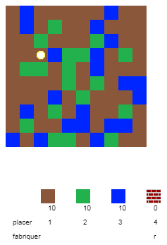
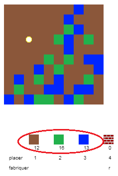
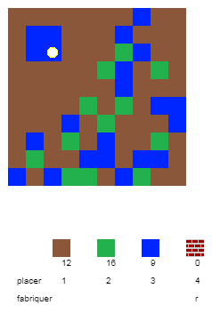
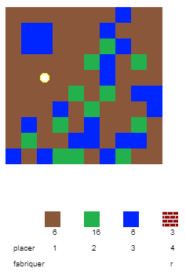
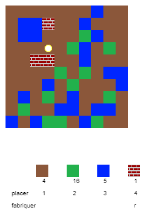

## Jouer au jeu

+ Ouvre cette trinket : [rpf.io/codecraft-on](http://rpf.io/codecraft-on){:target="_blank"}.

+ Utilise les touches ZQSD pour déplacer ton joueur dans le monde qui est plein de différentes ressources (terre, herbe, et eau).
    
    

+ Tu peux appuyer sur la barre espace pour récolter ces ressources. Ramasse quelques uns de chaque type de ressource, et tu verras qu'ils s'ajoutent à ton inventaire.
    
    

+ Appuie sur les touches numériques (1 à 3) pour placer une ressource sur la carte. Par exemple, appuie sur 3 pour placer de l'eau sur la carte. Cela ne fonctionnera que si tu as de l'eau dans ton inventaire.
    
    

+ Tu peux fabriquer un élément en appuyant sur la touche affichée dans le menu. Fabriquer signifie combiner les éléments que tu possèdes déjà dans ton inventaire pour en créer de nouveaux. Essaie d'appuyer sur la touche "r" pour fabriquer un nouveau bloc de brique (à condition que tu aies 1 de terre et 2 d'eau dans ton inventaire).
    
    

+ Tu peux maintenant appuyer sur la touche "4" pour déposer la brique fabriquée.
    
    