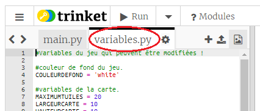

## Personnalise ton jeu

Modifions certaines variables pour changer le fonctionnement du jeu.

+ Clique sur le fichier `variables.py` pour voir les variables qui peuvent être changées.
    
    

+ Change la valeur de `COULEURDEFOND` et clique sur "Éxécuter" pour voir les changements dans ton jeu.
    
    

+ La variable `MAXIMUMTUILES` est la quantité de chaque ressource que peut contenir ton inventaire. Change cette variable si tu le désires pour stocker plus (ou moins) que 20 de chaque ressource.
    
    