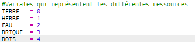
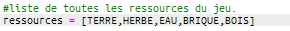
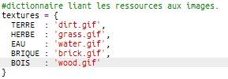
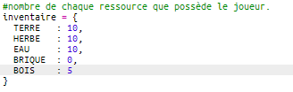
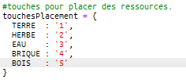
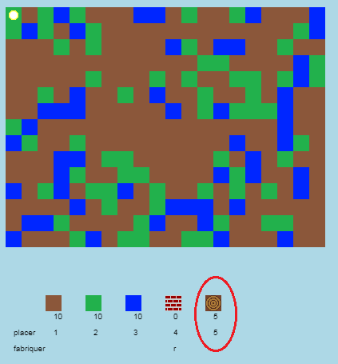
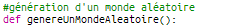
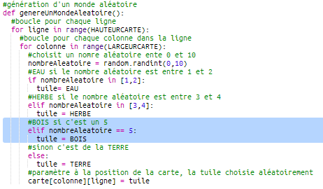

## Crée une nouvelle ressource: le bois

Créons une nouvelle ressource: le bois. Pour ce faire, tu vas avoir besoin d'ajouter quelques variables dans ton fichier `variables.py`.

+ D'abord, tu dois donner un numéro à ta nouvelle ressource. Tu pourras ensuite utiliser le mot `BOIS` dans ton code au lieu du nombre 4.
    
    

+ Tu devrais ajouter ta nouvelle ressource `BOIS` dans la liste de tes `ressources`.
    
    

+ Tu devrais également donner un nom à ta nouvelle ressource, qui sera affiché dans l'inventaire.
    
    
    
    Remarque la virgule `,` à la fin de la ligne ci dessus.

+ Ta ressource aura également besoin d'une image. Le projet inclut déjà une image appelée `bois.gif`, que tu devras ajouter au dictionnaire des `textures`.
    
    

+ Ajoute le nombre de ta ressource qui doit être présent dans ton `inventaire` au début de la partie.
    
    

+ Enfin, ajoute la touche qui doit être appuyé pour placer le bois sur le monde.
    
    

+ Exécute ton projet pour le tester. Tu verras maintenant que tu as une nouvelle ressource "bois" dans ton inventaire.
    
    

+ Il n'y a pas de bois sur la carte! Pour corriger cela, clique sur le fichier `main.py` et trouve la fonction appelée `genereUnMondeAleatoire()`.
    
    
    
    Ce code génère un nombre aléatoire entre 0 et 10, et utilise ces nombres pour choisir quelle ressource placer:
    
    + 1 ou 2 = eau
    + 3 ou 4 = herbe
    + quelque chose d'autre = TERRE

+ Ajoute ce code pour ajouter du bois sur ta carte dès que le `nombreAleatoire` vaut 5.
    
    

+ Teste ton projet à nouveau. Cette fois, tu dois voir du bois apparaître sur ton monde.
    
    