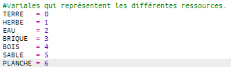
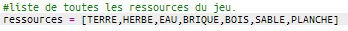
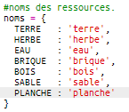
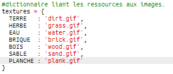
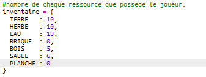
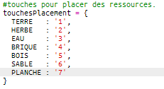
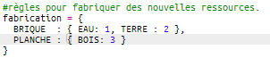
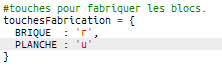

## Fabriquer des planches à partir du bois

Créons une nouvelle ressource planche qui peut être fabriquée à partir de bois.

+ D'abord, ajoute une nouvelle variable `PLANCHE` à ton jeu.
    
    

+ Ajoute une nouvelle variable `Planche` à ton jeu.
    
    

+ Nomme la ressource `'Planche'`.
    
    

+ Donne une image à ta ressource `Planche`. Le projet contient déjà une image `planche.gif`, mais tu peux créer la tienne si tu préfères.
    
    

+ Ajoutes des planches à ton inventaire.
    
    

+ Paramètre une touche pour placer des planches.
    
    

+ Comme cette ressource peut être crée, tu dois créer une règle de fabrication qui est qu'une planche peut être fabriquée à partir de 3 tuiles de bois. Ajoute ce code au dictionnaire `fabrication`.
    
    

+ Enfin, tu dois paramétrer une touche pour fabriquer des nouvelles planches.
    
    

+ Pour tester ta nouvelle ressource planche, rassemble plusieurs tuiles bois et fabrique quelques planches à partir du bois. Tu peux maintenant placer tes nouvelles planches sur ton monde.
    
    