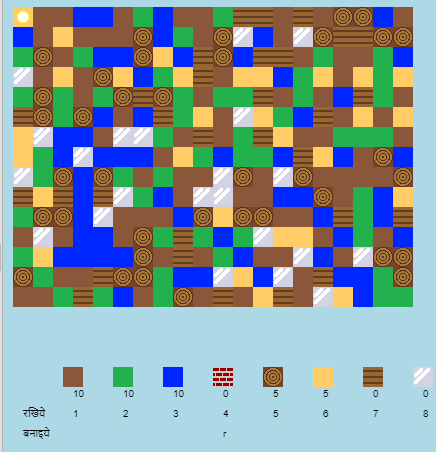

## भूमिका

इस परियोजना में, आप Minecraft 2D संस्करण में सुधार और डिजाइन करेंगे।

  <iframe src="https://trinket.io/embed/python/ebc5b0148b?outputOnly=true&start=result" width="600" height="500" frameborder="0" marginwidth="0" marginheight="0" allowfullscreen>
  </iframe>
  

### क्लब लीडरों के लिए अतिरिक्त जानकारीक्लब लीडर्स के लिए अतिरिक्त जानकारी

यदि आप इस परियोजना को प्रिंट करना चाहते हैं, तो कृपया [प्रिंटर अनुकूल संस्करण](https://projects.raspberrypi.org/en/projects/codecraft/print) का उपयोग करें।

## \--- collapse \---

## title: क्लब नेता नोट्स

## भूमिका:

इस परियोजना में, बच्चे एक मूल 2D Minecraft क्लोन में सुधार करके ग्राफिक्स और गेम डिज़ाइन के पहलुओं को जानेंगे। बच्चे नए संसाधन बनाएंगे, साथ ही नए संसाधन बनाने के लिए मौजूदा संसाधनों का उपयोग करने के लिए नियम बनाएंगे। यह चर, सूचियों और शब्दकोशों को समझने और हेरफेर करने से प्राप्त होगा।

## ऑनलाइन संसाधन

**इस प्रोजेक्ट में Python 3 का उपयोग किया जाता है।**Python को ऑनलाइन लिखने के लिए हम [trinket](https://trinket.io/) का उपयोग करने की सलाह देते हैं। इस प्रोजेक्ट में निम्नलिखित Trinket हैं:

+ ['कोडक्राफ्ट' प्रारंभक परियोजना - rpf.io/codecraft-on](http://rpf.io/codecraft-on)

एक ऐसा trinket भी है जिसमें पूरा प्रोजेक्ट है:

+ ['कोडक्राफ्ट' समाप्त - trinket.io/python/ebc5b0148b](https://trinket.io/python/ebc5b0148b)

## ऑफ़लाइन संसाधन

यदि चाहें तो इस परियोजना को [ऑफ़लाइन पूरा](https://www.codeclubprojects.org/en-GB/resources/python-working-offline/) किया जा सकता है। आप इस परियोजना के लिए 'प्रोजेक्ट सामग्री' लिंक पर क्लिक करके परियोजना के संसाधनों को प्राप्त कर सकते हैं। इस लिंक में 'परियोजना संसाधन' खंड है, जिसमें ऐसे संसाधन सम्मिलित हैं जिसकी बच्चों को इस परियोजना को ऑफ़लाइन पूरा करने की ज़रूरत होगी। सुनिश्चित करें कि प्रत्येक बच्चे को इन संसाधनों की प्रतिलिपि तक पहुँच प्राप्त होती है। इस खंड में निम्नलिखित फाइलें शामिल हैं:

+ codecraft/codecraft.py
+ codecraft/variables.py
+ codecraft/brick.gif
+ codecraft/dirt.gif
+ codecraft/glass.gif
+ codecraft/grass.gif
+ codecraft/plank.gif
+ codecraft/player.gif
+ codecraft/sand.gif
+ codecraft/water.gif
+ codecraft/wood.gif

आपको 'स्वयंसेवक संसाधन' खंड में इस प्रोजेक्ट का पूर्ण किया गया संस्करण भी मिल सकता है, जिसमें निम्न शामिल हैं:

+ codecraft-finished/codecraft.py
+ codecraft-finished/variables.py
+ codecraft-finished/brick.gif
+ codecraft-finished/dirt.gif
+ codecraft-finished/glass.gif
+ codecraft-finished/grass.gif
+ codecraft-finished/plank.gif
+ codecraft-finished/player.gif
+ codecraft-finished/sand.gif
+ codecraft-finished/water.gif
+ codecraft-finished/wood.gif

(उपर्युक्त सभी संसाधन `.zip` फ़ाइलों के रूप में भी डाउनलोड किए जा सकते हैं।)

## सीखने के उद्देश्य

+ ग्राफिक्स बनाना और संपादित करना;
+ गेम डिजाइन;
+ संपादन: 
    + वेरिएबल;
    + सूचियाँ;
    + शब्दकोश।

इस परियोजना में [Raspberry Pi डिजिटल निर्माण पाठ्यक्रम](http://rpf.io/curriculum) के निम्नलिखित पहलुओं के तत्व सम्मिलित हैं:

+ [बुनियादी 2D और 3D संपदाएँ डिज़ाइन करें |](https://www.raspberrypi.org/curriculum/design/creator)

+ [समस्या को हल करने के लिए प्रोग्रामिंग संरचनाओं को जोड़े।](https://www.raspberrypi.org/curriculum/programming/builder)

## चुनौतियाँ

+ "अपनी दुनिया का निर्माण करें" - गेम खेलना, मौजूदा ब्लॉकों को रखना और क्राफ्ट करना;
+ "अपना विश्व आकार बदलें" - ` MAPWIDTH का संपादन ` और ` MAPHEIGHT ` दुनिया के आकार को बदलने के लिए वेरिएबल;
+ "रेत बनाना" - संबंधित खेल डेटा के साथ एक नया रेत संसाधन बनाना।
+ "रेत से ग्लास बनाना" - एक नया बनने लायक ग्लास संसाधन बनाना।
+ "अधिक संसाधन बनाएं" - अधिक ब्लॉक और क्राफ्टिंग नियम बनाने के लिए जो सीखा गया है उसका उपयोग करें।

## अक्सर पूछे जाने वाले सवाल

+ बच्चों को यह याद दिलाने की आवश्यकता हो सकती है कि शब्दकोश/सूची के तत्व अल्पविराम द्वारा अलग किए गए हैं। उदाहरण के लिए, खेल में इन्वेंट्री आइटम, ग्राफिक्स और क्राफ्टिंग नियमों को जोड़ने पर।

\--- /collapse \---

## \--- collapse \---

## title: प्रोजेक्ट सामग्री

## परियोजना संसाधन

+ [सभी परियोजना संसाधनों वाली .zip फ़ाइल](http://rpf.io/p/en/codecraft-go)
+ [ऑनलाइन Trinket जिसमें सभी 'CodeCraft' प्रोजेक्ट संसाधन हैं](http://rpf.io/codecraft-on)

## क्लब लीडर ले लिए संसाधन

+ [सभी परियोजना संसाधनों वाली .zip फ़ाइल](http://rpf.io/p/en/codecraft-get)
+ [ऑनलाइन पूर्ण की गयी Trinket परियोजना](https://trinket.io/python/ebc5b0148b)

\--- /collapse \---