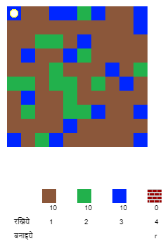
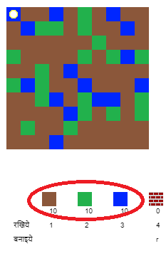
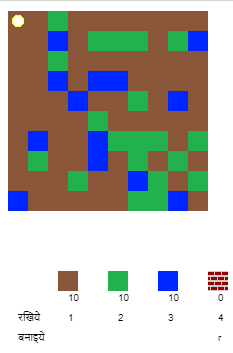
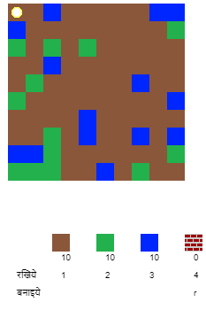

## गेम खेलना

+ इस Trinket को खोलें: [rpf.io/codecraft-on](http://rpf.io/codecraft-on) {:target="_blank"}।

+ दुनिया भर में अपने खिलाड़ी को स्थानांतरित करने के लिए WASD कुंजियों का उपयोग करें, जो विभिन्न संसाधनों (गंदगी, घास और पानी) से भरा है।
    
    

+ संसाधनों को इकट्ठा करने के लिए आप स्पेसबार को दबा सकते हैं। प्रत्येक प्रकार के कुछ संसाधन उठाएँ, और आप उन्हें अपनी सूची में जुड़ा हुआ देखेंगे।
    
    

+ मानचित्र पर संसाधन लगाने के लिए संख्या कुंजियों (1 से 3) को दबाएँ। उदाहरण के लिए, मानचित्र पर कुछ पानी रखने के लिए 3 दबाएं। यह तभी काम करेगा जब आपकी इन्वेंट्री में थोड़ा पानी होगा।
    
    

+ आप मेन्यू में प्रदर्शित कुंजी दबाकर किसी आइटम को शिल्प कर सकते हैं। क्राफ्टिंग का मतलब है कि नई वस्तुएं बनाने के लिए आपके पास पहले से मौजूद वस्तुओं का उपयोग करें। एक नई ईंट (जब तक आपकी सूची में 2 गंदगी और 1 पानी है) शिल्प करने के लिए 'r' कुंजी दबाने की कोशिश करें।
    
    

+ फिर आप अपनी गढ़ी हुई ईंटों को रखने के लिए वे '4' कुंजी दबा सकते हैं।
    
    