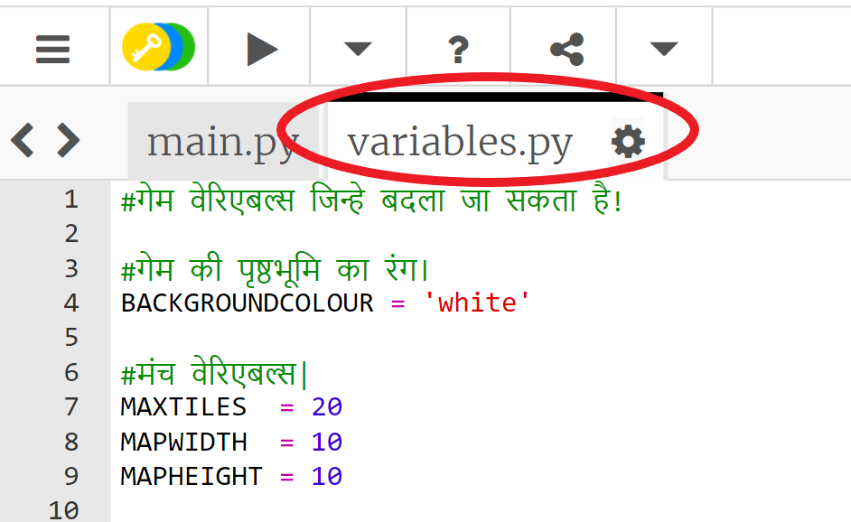

## अपनी गेम को कस्टमाइज़ करना

आइए कुछ वेरिएबल बदलकर देखते है आपका खेल कैसे काम करता है।

+ क्लिक करें `variables.py` फ़ाइल पर कुछ वेरियबल को देखने के लिए जिन्हें बदला जा सकता है।
    
    

+ अपने `BACKGROUNDCOLOUR` वेरिएबल का मान बदलें, और अपने खेल में परिवर्तन देखने के लिए 'Run' पर क्लिक करें।
    
    

+ वेरियबल `MAXTILES` प्रत्येक संसाधन की राशि है जो आपकी इन्वेंट्री में रखी जा सकती है। यदि आप प्रत्येक संसाधन के 20 से अधिक (या कम) संग्रह करना चाहते हैं, तो इस वेरिएबल को बदलें।
    
    