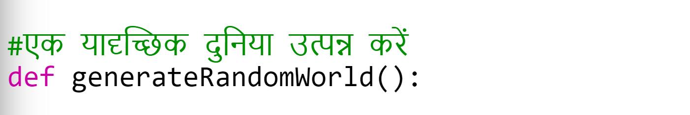

## नया लकड़ी संसाधन बनाना

चलो एक नया लकड़ी संसाधन बनाते हैं। ऐसा करने के लिए, आपको अपने ` variables.py ` फ़ाइल में कुछ वेरिएबल जोड़ने होंगे।

+ सबसे पहले, आपको अपने नए संसाधन को एक संख्या देनी होगी। फिर आप ` WOOD ` शब्द का उपयोग कर पाएंगे संख्या 4 के बजाय अपने कोड में।
    
    

+ आपको अपना नया `WOOD` संसाधन जोड़ना चाहिए आपकी `संसाधनों` की सूची में।
    
    

+ आपको अपने संसाधन को एक नाम भी देना चाहिए, जिसे इन्वेंट्री में प्रदर्शित किया जाएगा।
    
    
    
    ऊपर की पंक्ति के अंत में अल्पविराम को देखें `, `।

+ आपके संसाधन को एक छवि की भी आवश्यकता होगी। परियोजना में पहले से ही `wood.gif` नामक छवि शामिल है, जो आपको `बनावट` शब्दकोश में जोड़ना चाहिए।
    
    

+ अपने संसाधन की संख्या जोड़ें जो आपकी `सूची` में होनी चाहिए शुरू करने के लिए।
    
    

+ अंत में, वह कुंजी जोड़ें जिसे आप दुनिया में लकड़ी रखने के लिए दबाएंगे।
    
    

+ इसका परीक्षण करने के लिए अपना कोड चलाएं। आप देखेंगे कि अब आपके पास अपनी सूची में एक नया 'wood' संसाधन है।
    
    

+ आपकी दुनिया में कोई लकड़ी नहीं है! इसे ठीक करने के लिए, अपने `main.py` फ़ाइल पर क्लिक करें और `generateRandomWorld()` फ़ंक्शन खोजें।
    
    
    
    यह कोड 0 और 10 के बीच एक यादृच्छिक संख्या उत्पन्न करता है, और यह तय करने के लिए संख्या का उपयोग करता है कि किस संसाधन को स्थान दिया जाए:
    
    + 1 या 2 = पानी
    + 3 या 4 = घास
    + कुछ और = गंदगी

+ जब भी `randomNumber` 5 है अपनी दुनिया में लकड़ी जोड़ने के लिए इस कोड को जोड़ें।
    
    

+ अपने प्रोजेक्ट का फिर से परीक्षण करें। इस बार, आपको अपनी दुनिया में कुछ लकड़ी दिखाई देनी चाहिए।
    
    