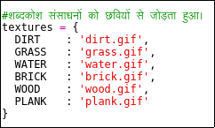
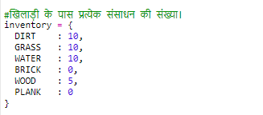
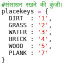
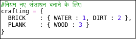
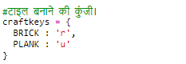

## लकड़ी से तख्ते बनाना

आइए एक नया तख़्त संसाधन बनाएं जो लकड़ी से तैयार किया गया हो।

+ सबसे पहले, एक नया `PLANK` वेरिएबल अपने खेल के में जोड़ें।
    
    

+ सबसे पहले, एक नया ` PLANK ` वेरिएबल अपने खेल में जोड़ें।
    
    

+ संसाधन का नाम रखें` 'plank'` ।
    
    

+ अपने `PLANK` संसाधन को एक छवि दें । परियोजना में पहले से ही एक `plank.gif` छवि शामिल है, लेकिन यदि आप चाहें तो आप खुद की छवि बना सकते हैं और अपलोड कर सकते हैं।
    
    

+ अपनी सूची में तख्तियां जोड़ें।
    
    

+ तख्तों को रखने के लिए एक कुंजी तय करें।
    
    

+ क्योंकि इस संसाधन को तैयार किया जा सकता है, आपको एक क्राफ्टिंग नियम बनाने की आवश्यकता है, जो यह है कि 3 लकड़ी की टाइलों से एक तख़्त बनाया जा सकता है। इस कोड को अपने `विद्युत (crafting)` शब्दकोश में जोड़ें।
    
    

+ अंत में, आपको नए तख्तों को तैयार करने के लिए एक कुंजी तय करने की आवश्यकता है।
    
    

+ अपने नए तख़्त संसाधन का परीक्षण करने के लिए, कुछ लकड़ी की टाइलें इकट्ठा करें और फिर अपनी लकड़ी से कुछ तख्तों को तैयार करें। तब आप अपनी दुनिया में अपने नए तख्तों को रख सकते हैं।
    
    