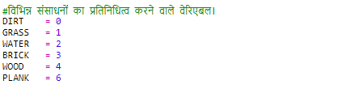
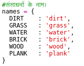
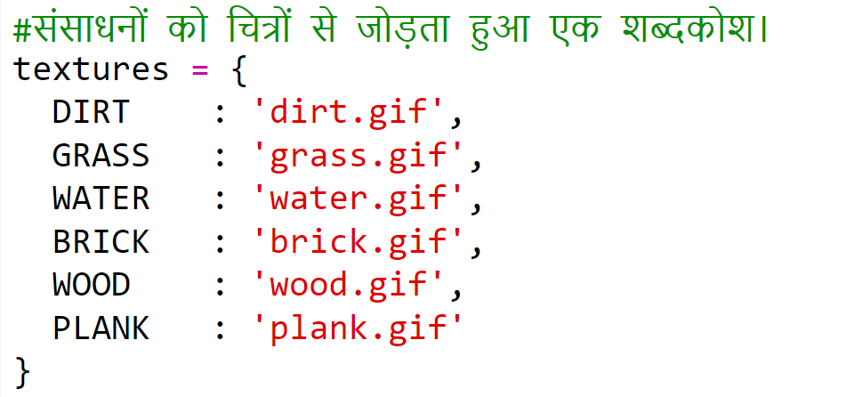

## लकड़ी से तख्तों को क्राफ्ट करना

चलिए नया तख्ता बनाएँ, जिसे लकड़ी से क्राफ्ट किया जा सकता है।

+ सबसे पहले, अपनी गेम में नया `PLANK` (तख्ता) वेरिएबल जोड़ें।

    

+ अपनी गेम में नया `PLANK` वेरिएबल जोड़ें।

    

+ संसाधन को `'plank'` का नाम दें।

    

+ अपने `PLANK` संसाधनों में चित्र जोड़ें। प्रोजेक्ट में पहले से ही `plank.png` चित्र शामिल है, परन्तु यदि आप चाहें तो अपना स्वयं का चित्र बना सकते हैं।

    

+ अपनी इनवेंटरी में तख्ते जोड़ें।

    

+ तख्ते रखने के लिए कुंजी निर्धारित करें।

    

+ चूँकि इस संसाधन को क्राफ्ट किया जा सकता है, इसलिए आपको क्राफ्टिंग का नियम बनाना होगा, जिसका अर्थ है कि लकड़ी की 3 टाइलों से एक तख्ता बनाया जा सकता है। इस कोड को `crafting` (क्राफ्टिंग) डिक्शनरी में जोड़ें। 

    

+ अंतत: आपको नए तख्ते क्राफ्ट करने के लिए कुंजी सेट करनी होगी।

    

+ अपने नए तख्ते के संसाधन का परीक्षण करने के लिए, लकड़ी की कुछ टाइलों को एकत्रित करें और फिर अपनी लकड़ी से तख्ते क्राफ्ट करें। इसके बाद आप अपनी दुनिया में अपने नए तख्ते जोड़ सकते हैं।

    

