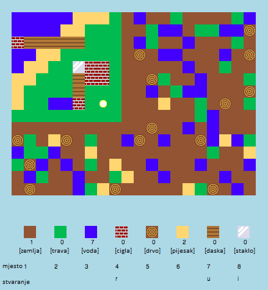

## Uvod

U ovom projektu dizajnirat ćeš i kodirati poboljšanja za 2D verziju Minecrafta.

  <iframe src="https://trinket.io/embed/python/ebc5b0148b?outputOnly=true&start=result" width="600" height="500" frameborder="0" marginwidth="0" marginheight="0" allowfullscreen>
  </iframe>
  

### Dodatne informacije za voditelje kluba

Ako želite ispisati ovaj projekt, molimo Vas da koristite [verziju koja je prilagođena za ispis](https://projects.raspberrypi.org/en/projects/codecraft/print).

## \--- collapse \---

## naslov: Bilješke voditelja kluba

## Uvod:

U ovom projektu djeca će naučiti aspekte grafike i dizajna igara tako što će poboljšati kopiju igre 2D Minecraft. Napravit će nove resurse te osmisliti pravila za kombiniranje resursa kako bi stvorili nove resurse. To će postići razumijevanjem i manipulacijom varijabli, listi i rječnika.

## Online izvori

**U ovom projektu koristi se Python 3.** Predlažemo korištenje [trinketa](https://trinket.io/) za online pisanje u Pythonu. Ovaj projekt sadrži sljedeće Trinkete:

+ ['CodeCraft' starter project -- rpf.io/codecraft-on](http://rpf.io/codecraft-on)

Također je uključen i trinket koji sadrži dovršeni projekt:

+ [‘CodeCraft’ dovršeni projekt -- trinket.io/python/ebc5b0148b](https://trinket.io/python/ebc5b0148b)

## Offline izvori

Ako želite, ovaj projekt može bit [završen offline](https://www.codeclubprojects.org/en-GB/resources/python-working-offline/). Materijalima projekta možete pristupiti klikom na poveznicu 'Project Materials'. Poveznica sadrži odjeljak 'Project Resources' u kojem se nalaze materijali koji će djeci biti potrebni za izradu projekta offline. Pobrinite se da svako dijete ima pristup kopiji ovih materijala. U odjeljku se nalaze sljedeće datoteke:

+ codecraft/codecraft.py
+ codecraft/variables.py
+ codecraft/brick.gif
+ codecraft/dirt.gif
+ codecraft/glass.gif
+ codecraft/grass.gif
+ codecraft/plank.gif
+ codecraft/player.gif
+ codecraft/sand.gif
+ codecraft/water.gif
+ codecraft/wood.gif

Dovršenu verziju projekta možete pronaći i u odjeljku ‘Resursi za volontere’ koji sadrži:

+ codecraft-finished/codecraft.py
+ codecraft-finished/variables.py
+ codecraft-finished/brick.gif
+ codecraft-finished/dirt.gif
+ codecraft-finished/glass.gif
+ codecraft-finished/grass.gif
+ codecraft-finished/plank.gif
+ codecraft-finished/player.gif
+ codecraft-finished/sand.gif
+ codecraft-finished/water.gif
+ codecraft-finished/wood.gif

(All of the resources above are also downloadable as `.zip` files.)

## Ishodi učenja

+ Stvaranje i uređivanje grafike;
+ Dizajn igre;
+ Uređivanje: 
    + Varijable;
    + Lista;
    + Rječnika.

Ovaj projekt obuhvaća elemente iz sljedećih dijelova [ Raspberry Pi Digital Making](http://rpf.io/curriculum) nastavnog plana i programa:

+ [Izrada jednostavnih 2D i 3D predmeta.](https://www.raspberrypi.org/curriculum/design/creator)

+ [Uporaba različitih programskih struktura za rješavanje problema.](https://www.raspberrypi.org/curriculum/programming/builder)

## Izazovi

+ "Izgradi svoj svijet" - igranje igre, postavljanje i izrada postojećih blokova;
+ "Promijeni veličinu svog svijeta" - uređivanje `SIRINAMAPE` i `VISINAMAPE` varijabli radi izmjene veličine svijeta;
+ "Stvori pijesak" - stvaranje novog resursa, pijeska, zajedno s ostalim potrebnim podatcima.
+ "Izradi staklo od pijeska" - stvaranje novog resursa, stakla, korištenjem već postojećeg resursa pijeska.
+ "Stvori još elemenata" - primjena naučenog za stvaranje još elemenata i pravila za izradu resursa.

## Često postavljana pitanja

+ Djecu će možda biti potrebno podsjetiti da se elementi unutar rječnika/liste odvajaju zarezom. Na primjer pri dodavanju resursa u inventar, grafike i pravila za izradu resursa u igru.

\--- /collapse \---

## \--- collapse \---

## naslov: Projektni materijali

## Resursi projekta

+ [.zip datoteka koja sadrži sve materijale projekta](resources/codecraft-resources.zip)
+ [Online Trinket koji sadrži sve resurse projekta "CodeCraft"](http://rpf.io/codecraft-on)

## Materijali za voditelja Kluba

+ [.zip datoteka koja sadrži sve dovršene materijale projekta](solutions/codecraft-solution.zip)
+ [Dovršeni Online Trinket projekt](https://trinket.io/python/ebc5b0148b)

\--- /collapse \---