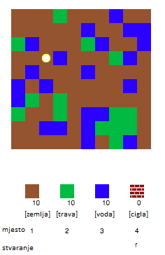
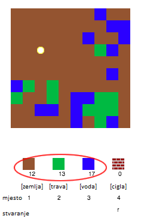
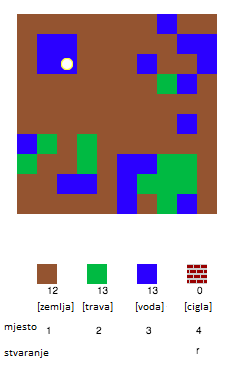
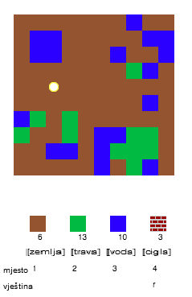
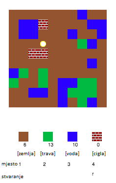

## Igranje igre

+ Open this trinket: [rpf.io/codecraft-on](http://rpf.io/codecraft-on){:target="_blank"}.

+ Koristi tipke W, A, S i D za pomicanje igrača po svijetu, koji je prepun različitih resursa (zemlje, trave i vode).
    
    

+ Pritiskom razmaknice možeš sakupiti resurs. Pokupi nekoliko komada od svakog resursa i vidjet ćeš da su dodani tvom inventaru.
    
    

+ Pritisni brojeve od 1 do 3 za postavljanje resursa na mapu. Primjerice, pritisni 3 da bi na mapu stavio vodu. Ovo će funkcionirati samo ako imaš vodu u svom inventaru.
    
    

+ Možeš izraditi resurs tako da pritisneš tipku prikazanu u izborniku. Izrađivanje znači spajanje resursa koje već imaš u inventaru kako bi napravio nove resurse. Pokušaj pritisnuti tipku 'r' kako bi izradio novu ciglu (to je moguće samo ako imaš barem 2 zemlje i 1 vodu u inventaru).
    
    

+ Zatim pritisni tipku '4' da postaviš cigle koje si izradio.
    
    