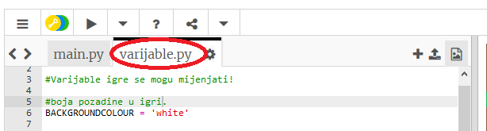
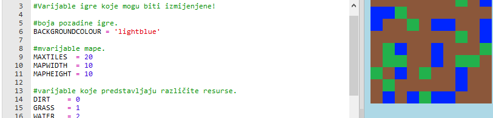
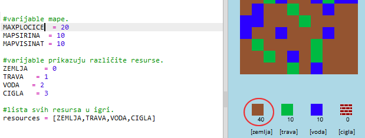

## Prilagodba igre

Izmijenimo neke od varijabli kako bi promijenili način na koji igra funkcionira.

+ Klikni na datoteku `variables.py` kako bi pogledao neke od varijabli koje se mogu izmijeniti.
    
    

+ Promijeni vrijednost varijable `BOJAPOZADINE` pa klikni na ‘Run’ da bi vidio promjene.
    
    

+ Varijabla `PLOCICEMAX` predstavlja količinu svakog elementa koji se može nalaziti u tvom inventaru. Izmijeni ovu varijablu ako želiš da se u tvom inventaru pohranjuje više (ili manje) od 20 komada svakog elementa.
    
    