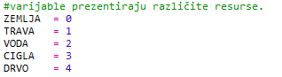
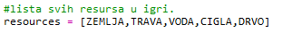
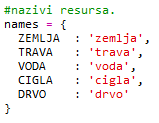
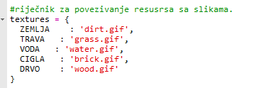
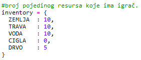
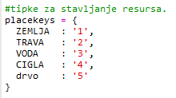
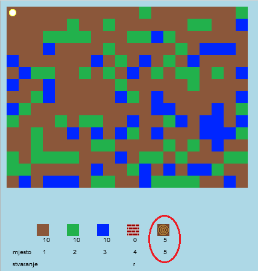
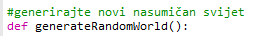
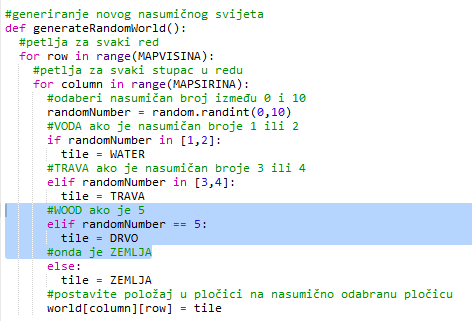

## Stvori novi resurs - drvo

Stvorimo novi resurs - drvo. Da bi to napravili, moramo dodati još neke varijable u datoteku `variables.py`.

+ Prvo moraš odabrati broj za svoj novi resurs. Tada ćeš, umjesto broja 4, moći koristiti riječ DRVO u kôdu.
    
    

+ Dodaj novi resurs `DRVO` unutar svoje liste `resursi`.
    
    

+ Također moraš svom resursu dati naziv koji će se prikazivati u inventaru.
    
    
    
    Primijeti da se na kraju linija nalazi zarez`,`.

+ Tvoj resurs trebat će i sliku. U projektu se već nalazi slika pod nazivom `wood.gif` koju ćeš dodati u rječnik naziva `teksture`.
    
    

+ Za početak, u rječnik `inventar` dodaj broj koji si pridružio resursu.
    
    

+ Zatim dodaj tipku kojom ćeš postaviti drvo u svijet.
    
    

+ Pokreni i testiraj projekt. Vidjet ćeš da sada imaš novi resurs 'drvo' u svom inventaru.
    
    

+ U tvom svijetu nema drva! Popravi to tako da odabereš datoteku `main.py` i pronađeš funkciju `generateRandomWorld()`.
    
    
    
    Ovaj kôd nasumično generira broj između 0 i 10, a dobiveni broj odlučuje koji element će se postaviti u svijet:
    
    + 1 ili 2 = voda
    + 3 ili 4 = trava
    + bilo što drugo = ZEMLJA

+ Unesi sljedeći kôd kako bi dodao drvo u svoj svijet svaki put kada je `randomNumber` 5.
    
    

+ Ponovno testiraj projekt. Ovoga bi se puta drvo trebalo pojaviti u tvom svijetu.
    
    