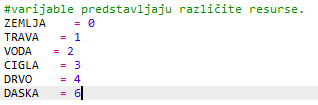
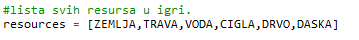
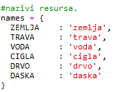
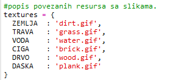
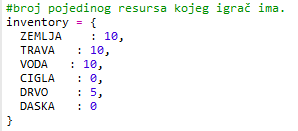
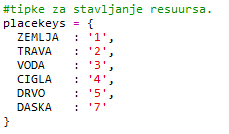
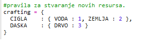
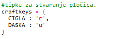

## Izradi daske od drva

Napravimo novi resurs, dasku, koji se može izraditi od drva.

+ Prvo stvori u igri novu varijablu `DASKA`.
    
    

+ Dodaj igri novu varijablu `DASKA`.
    
    

+ Nazovi resurs `'daska'`.
    
    

+ Pridruži resursu `DASKA` sliku. U projektu se već nalazi slika `plank.gif`, ali možeš stvoriti i vlastitu ako želiš.
    
    

+ Dodaj daske u svoj inventar.
    
    

+ Odredi tipku kojom će se daske postavljati u svijet.
    
    

+ S obzirom da je ovo resurs koji može biti izrađen od drugih resursa, moraš utvrditi po kojim pravilima može biti izrađen. Neka pravilo bude da se daska može izraditi od 3 komada drveta. Dodaj ovaj kôd u svoj rječnik `izrada`.
    
    

+ Na kraju, moraš odrediti kojom tipkom će se izrađivati nove daske.
    
    

+ Testiraj svoj novi resurs dasku. Sakupi nekoliko komada drveta i od njih izradi daske. Zatim postavi svoje nove daske u svijet.
    
    