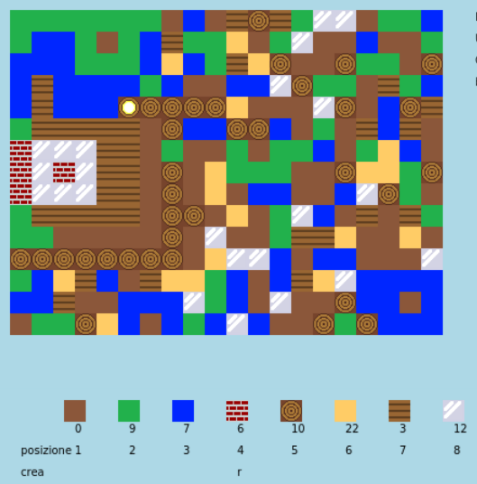

## Introduzione

In questo progetto, progetterai e migliorerai il codice di una versione 2D di Minecraft.

  <iframe src="https://trinket.io/embed/python/ebc5b0148b?outputOnly=true&start=result" width="600" height="500" frameborder="0" marginwidth="0" marginheight="0" allowfullscreen>
  </iframe>
  

### Ulteriori informazioni per gli organizzatori dei club

Se intendete stampare questo progetto, cliccate su [Versione stampabile](https://projects.raspberrypi.org/en/projects/codecraft/print).

## \--- collapse \---

## title: Note per i volontari

## Introduzione:

In this project, children will learn aspects of graphics and game design by making improvements to a basic 2D Minecraft clone. I bambini creeranno nuove risorse, oltre a creare regole per combinare le risorse al fine di crearne di nuove. Ciò sarà possibile attraverso la comprensione e la manipolazione di variabili, liste e dizionari.

## Risorse online

**Questo progetto utilizza Python 3.** Consigliamo di utilizzare [trinket](https://trinket.io/) per scrivere in linguaggio Python online. Questo progetto contiene i seguenti Trinket:

+ [Progetto iniziale 'CodeCraft' -- rpf.io/codecraft-on](http://rpf.io/codecraft-on)

C'è anche un trinket che contiene il progetto completo:

+ ['CodeCraft' finito - trinket.io/python/ebc5b0148b](https://trinket.io/python/ebc5b0148b)

## Risorse offline

Questo progetto può anche essere [completato offline](https://www.codeclubprojects.org/en-GB/resources/python-working-offline/). È possibile accedere alle risorse del progetto facendo click sul link "Materiali del progetto" relativo a questo progetto. Alla sezione "Risorse del progetto", sono raccolte le risorse necessarie ai bambini per completare il progetto offline. È bene assicurarsi che tutti i bambini abbiano accesso a una copia di queste risorse. Questa sezione contiene i seguenti file:

+ codecraft/codecraft.py
+ codecraft/variables.py
+ codecraft/brick.gif
+ codecraft/dirt.gif
+ codecraft/glass.gif
+ codecraft/grass.gif
+ codecraft/plank.gif
+ codecraft/player.gif
+ codecraft/sand.gif
+ codecraft/water.gif
+ codecraft/wood.gif

Potete anche trovare una versione completa di questo progetto nella sezione 'Risorse per i volontari', che contiene:

+ codecraft-finished/codecraft.py
+ codecraft-finished/variables.py
+ codecraft-finished/brick.gif
+ codecraft-finished/dirt.gif
+ codecraft-finished/glass.gif
+ codecraft-finished/grass.gif
+ codecraft-finished/plank.gif
+ codecraft-finished/player.gif
+ codecraft-finished/sand.gif
+ codecraft-finished/water.gif
+ codecraft-finished/wood.gif

(Tutte le risorse sopra indicate possono essere scaricate anche come file `.zip`)

## Obiettivi di apprendimento

+ Creazione e modifica di grafica;
+ Progettazione di un gioco;
+ Sviluppo: 
    + Variabili;
    + Liste;
    + Dizionari.

Questo progetto include elementi tratti dalle seguenti componenti del [Digital Making Curriculum di Raspberry Pi](http://rpf.io/curriculum):

+ [Progettazione di elementi 2D e 3D semplici.](https://www.raspberrypi.org/curriculum/design/creator)

+ [Combinare i costrutti base di un linguaggio di programmazione per risolvere un problema.](https://www.raspberrypi.org/curriculum/programming/builder)

## Sfide

+ "Build your world" - Playing the game, placing and crafting existing blocks;
+ "Modifica la dimensione del tuo mondo" - modifica le variabili `LARGHEZZAMAPPA` e `ALTEZZAMAPPA` per modificare la dimensione del mondo;
+ "Creazione di sabbia": creazione di una nuova risorsa 'sabbia', insieme ai dati di gioco associati.
+ "Crafting glass from sand" - Creating a new craftable glass resource.
+ "Create more resources" - Use what's been learnt to create more blocks and crafting rules.

## Frequently Asked Questions

+ Children may need reminding that elements of a dictionary/list are separated by a comma. For example, when adding inventory items, graphics and crafting rules to the game.

\--- /collapse \---

## \--- collapse \---

## title: Project materials

## Project resources

+ [.zip file containing all project resources](resources/codecraft-resources.zip)
+ [Online Trinket containing all 'CodeCraft' project resources](http://rpf.io/codecraft-on)

## Club leader resources

+ [.zip file containing all completed project resources](solutions/codecraft-solution.zip)
+ [Online completed Trinket project](https://trinket.io/python/ebc5b0148b)

\--- /collapse \---