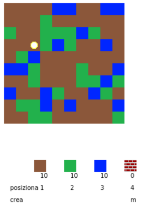
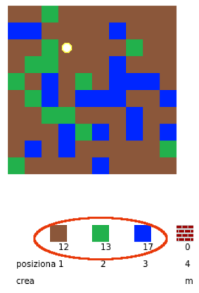
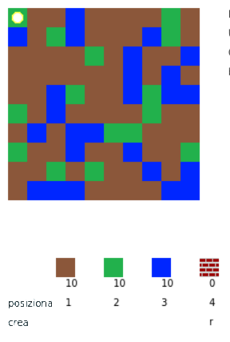
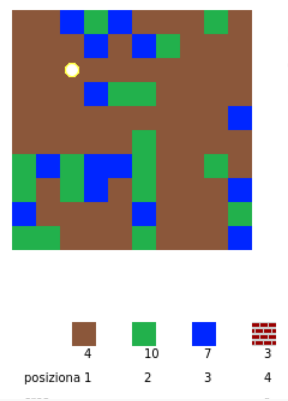
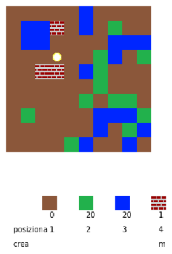

## Inizia la partita

+ Apri questo trinket: [rpf.io/codecraft-on](http://rpf.io/codecraft-on){:target="_blank"}.

+ Usa i tasti WASD per spostare il tuo giocatore in tutto il mondo, che è pieno di risorse diverse (terra, erba e acqua).
    
    

+ Puoi premere la barra spaziatrice per raccogliere risorse. Raccogli alcuni esemplari di ogni tipo di risorsa e li vedrai aggiunti al tuo inventario.
    
    

+ Premi i tasti numerici (da 1 a 3) per posizionare una risorsa sulla mappa. Ad esempio, premere 3 per posizionare un po d'acqua sulla mappa. Funzionerà solo se hai un po' d'acqua nel tuo inventario.
    
    

+ Puoi creare un oggetto premendo il tasto visualizzato nel menu. Creare significa combinare oggetti che hai già nel tuo inventario per crearne di nuovi. Prova a premere il tasto 'r' per creare un nuovo mattone (a condizione che tu abbia 2 terre e 1 acqua nel tuo inventario).
    
    

+ È quindi possibile premere il tasto '4' per posizionare i mattoni creati.
    
    