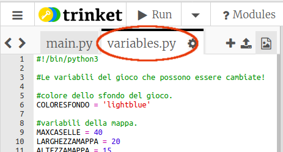
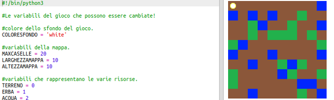
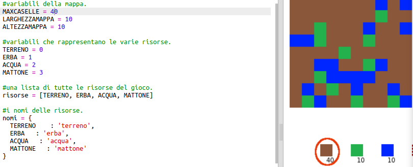

## Personalizza il tuo gioco

Modifichiamo alcune variabili per cambiare il funzionamento del tuo gioco.

+ Fai clic su `variables.py` per vedere alcune variabili che possono essere modificate.
    
    

+ Cambia il valore del tuo `COLORESFONDO` variabile e fai clic su "Esegui" per vedere la modifica al tuo gioco.
    
    

+ La variabile `MAXCASELLE` è la quantità di ogni risorsa che può essere trattenuta nel tuo inventario. Modificare questa variabile se si desidera archiviare più (o meno) di 20 unità di ciascuna risorsa.
    
    