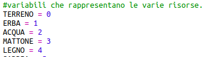
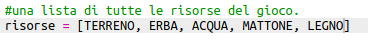
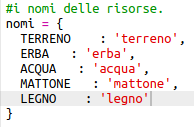
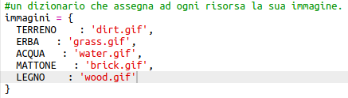
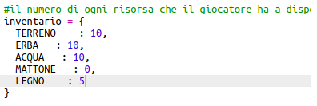
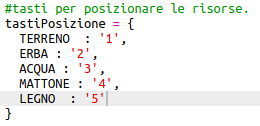
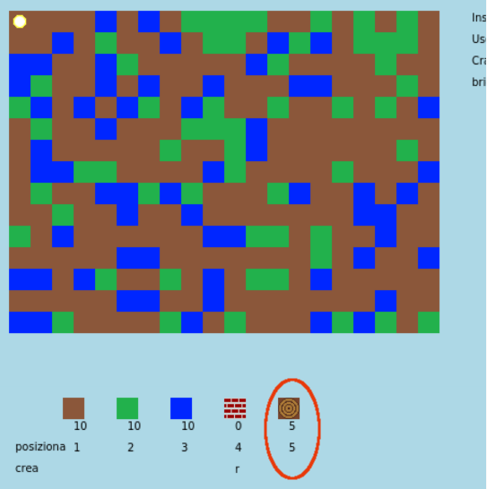
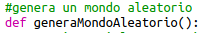
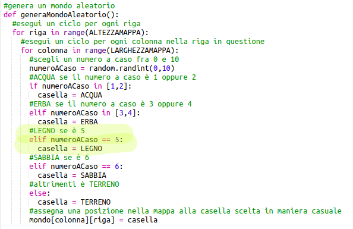

## Creazione della nuova risorsa legno

Creiamo una nuova risorsa: il legno. Per farlo, dovrai aggiungere ad alcune variabili nel tuo file `variables.py`.

+ Innanzitutto, devi assegnare un numero alla tua nuova risorsa. Potrai quindi usare la parola `LEGNO` nel tuo codice invece del numero 4.
    
    

+ Devi aggiungere la tua nuova risorsa `LEGNO` all'elenco di `risorse`.
    
    

+ Dovresti anche dare un nome alla tua risorsa, che verrà visualizzato nell'inventario.
    
    
    
    Nota la virgola `,` alla fine della riga sopra.

+ La tua risorsa avrà anche bisogno di un'immagine. Il progetto include già un'immagine chiamata `wood.gif`, che dovresti aggiungere al dizionario delle `trame` (textures).
    
    

+ Aggiungi il numero della tua risorsa che dovrebbe essere nel tuo `inventario` per iniziare.
    
    

+ Infine, aggiungi il tasto che premerai per posizionare la legna nel mondo.
    
    

+ Esegui il tuo progetto per provarlo. Vedrai che ora hai una nuova risorsa "legno" nel tuo inventario.
    
    

+ Non c'è legno nel tuo mondo! Per risolvere questo problema, fai clic su `main.py` file e trova la funzione chiamata `generaMondoAleatorio()`.
    
    
    
    Questo codice genera un numero casuale compreso tra 0 e 10 e utilizza il numero per decidere quale risorsa posizionare:
    
    + 1 o 2 = acqua
    + 3 o 4 = erba
    + qualsiasi altra cosa = TERRENO

+ Aggiungi questo codice per aggiungere legna al tuo mondo ogni volta che `randomNumber` è 5.
    
    

+ Prova di nuovo il tuo codice. Questa volta, dovresti vedere del legno apparire nel tuo mondo.
    
    