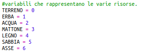

## Fabbricare tavole di legno

Creiamo una nuova risorsa da costruire a partire dal legno.

+ Per prima cosa, aggiungi una nuova variabile `ASSE` al tuo gioco.
    
    

+ Aggiungi una nuova variabile `ASSE` al tuo gioco.
    
    

+ Denominare la risorsa `'asse'`.
    
    

+ Dai alla tua risorsa `ASSE` un'immagine. Il progetto include già un'immagine `plank.gif`, ma puoi creare e caricare la tua se preferisci.
    
    

+ Aggiungi tavole al tuo inventario.
    
    

+ Impostare una chiave per posizionare le tavole.
    
    

+ Poiché questa risorsa può essere realizzata, è necessario creare una regola di creazione, ovvero che una tavola può essere realizzata utilizzando 3 tessere di legno. Aggiungi questo codice al dizionario `creazione`.
    
    

+ Infine, è necessario impostare una chiave per la creazione di nuove tavole.
    
    

+ Per testare la tua nuova risorsa tavola, raccogli alcune tessere di legno e poi crea alcune tavole dal tuo legno. Puoi quindi posizionare le tue nuove tavole nel tuo mondo.
    
    