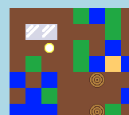

\--- challenge \---

## Sfida: Fabbricare il vetro con la sabbia

Puoi creare una nuova risorsa di vetro, che può essere fabbricata dalla sabbia? Puoi utilizzare i passaggi precedenti per aiutarti.

Il progetto include già un'immagine `glass.gif`, ma puoi creare e caricare la tua se preferisci.

\--- /challenge \---