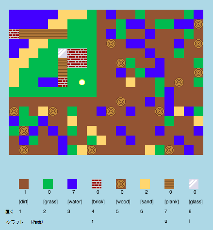

## はじめに

このプロジェクトでは、Minecraftの2Dバージョンの設計とコードの改善を行います。

  <iframe src="https://trinket.io/embed/python/ebc5b0148b?outputOnly=true&start=result" width="600" height="500" frameborder="0" marginwidth="0" marginheight="0" allowfullscreen>
  </iframe>
  

### クラブリーダーのための追加情報

このプロジェクトを印刷する必要がある場合は、 [印刷用バージョン](https://projects.raspberrypi.org/en/projects/codecraft/print)を使用してください。

## \--- collapse \---

## title：クラブリーダー・ノート

## はじめに

このプロジェクトでは、子供たちは基本的な2Dマインクラフトのクローンを改良することにより、グラフィクスとゲームデザインを学びます。 Children will create new resources, as well as crafting rules for combining resources to make new ones. This will be achieved by understanding and manipulating variables, lists and dictionaries.

## Online Resources

**This project uses Python 3.** We recommend using [trinket](https://trinket.io/) to write Python online. This project contains the following Trinkets:

+ ['CodeCraft' starter project -- rpf.io/codecraft-on](http://rpf.io/codecraft-on)

There is also a trinket containing the completed project:

+ [‘CodeCraft’ Finished -- trinket.io/python/ebc5b0148b](https://trinket.io/python/ebc5b0148b)

## Offline Resources

This project can be [completed offline](https://www.codeclubprojects.org/en-GB/resources/python-working-offline/) if preferred. You can access the project resources by clicking the 'Project Materials' link for this project. This link contains a 'Project Resources' section, which includes resources that children will need to complete this project offline. Make sure that each child has access to a copy of these resources. This section includes the following files:

+ codecraft/codecraft.py
+ codecraft/variables.py
+ codecraft/brick.gif
+ codecraft/dirt.gif
+ codecraft/glass.gif
+ codecraft/grass.gif
+ codecraft/plank.gif
+ codecraft/player.gif
+ codecraft/sand.gif
+ codecraft/water.gif
+ codecraft/wood.gif

You can also find a completed version of this project in the 'Volunteer Resources' section, which contains:

+ codecraft-finished/codecraft.py
+ codecraft-finished/variables.py
+ codecraft-finished/brick.gif
+ codecraft-finished/dirt.gif
+ codecraft-finished/glass.gif
+ codecraft-finished/grass.gif
+ codecraft-finished/plank.gif
+ codecraft-finished/player.gif
+ codecraft-finished/sand.gif
+ codecraft-finished/water.gif
+ codecraft-finished/wood.gif

(All of the resources above are also downloadable as `.zip` files.)

## Learning Objectives

+ Creating and editing graphics;
+ Game design;
+ Editing: 
    + Variables;
    + Lists;
    + Dictionaries.

This project covers elements from the following strands of the [Raspberry Pi Digital Making Curriculum](http://rpf.io/curriculum):

+ [Design basic 2D and 3D assets.](https://www.raspberrypi.org/curriculum/design/creator)

+ [Combine programming constructs to solve a problem.](https://www.raspberrypi.org/curriculum/programming/builder)

## Challenges

+ "Build your world" - Playing the game, placing and crafting existing blocks;
+ "Change your world size" - editing the `MAPWIDTH` and `MAPHEIGHT` variables to change the world size;
+ "Creating sand" - Creating a new sand resource, along with associated game data.
+ "Crafting glass from sand" - Creating a new craftable glass resource.
+ "Create more resources" - Use what's been learnt to create more blocks and crafting rules.

## Frequently Asked Questions

+ Children may need reminding that elements of a dictionary/list are separated by a comma. For example, when adding inventory items, graphics and crafting rules to the game.

\--- /collapse \---

## \--- collapse \---

## title: Project materials

## Project resources

+ [.zip file containing all project resources](resources/codecraft-resources.zip)
+ [Online Trinket containing all 'CodeCraft' project resources](http://rpf.io/codecraft-on)

## Club leader resources

+ [.zip file containing all completed project resources](solutions/codecraft-solution.zip)
+ [Online completed Trinket project](https://trinket.io/python/ebc5b0148b)

\--- /collapse \---