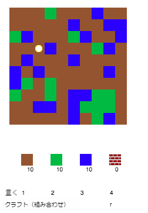

## ゲームをする

+ 次のTrinketのテンプレートを開きます：[rpf.io/codecraft-on](http://rpf.io/codecraft-on){:target="_blank"}

+ キーボード上のW A S Dキーを使ってたくさんのリソース（土・草・水）で埋め尽くされたワールド内のプレイヤーを動かします。
    
    

+ スペースバーを押すとその下にあるリソースを拾います。 それぞれのタイプのリソースを拾って、下段にある持ち物リストに追加されたことを確認してください。
    
    

+ 数字キー１から３を押して、リソースを地図上に置きます。 たとえば、３キーを押して水を地図上に置きます。 これは、持ち物リストに水がある時だけできます。
    
    

+ メニューに表示されたキーを押し、アイテムをクラフト（組み合わせ）する。 クラフトとは、このプロジェクトでは、すでに持っているアイテムを組み合わせて新しいものを作ることを言います 。 Rキーを押し、新しいレンガをクラフトします（２つの土と１つの水が持ち物リストにある場合のみ）。
    
    

+ 4キーを押してクラフトされたレンガを置きます。
    
    