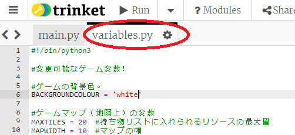
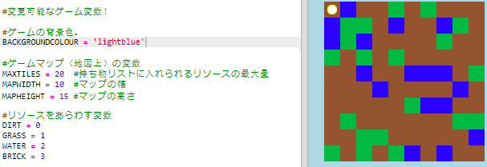
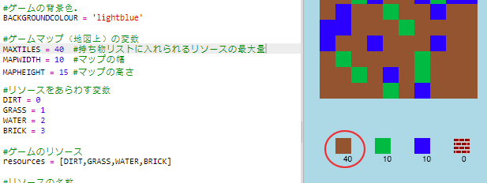

## ゲームをカスタマイズする

いくつかの変数を変更して、ゲームの動作を変更しましょう。

+ `variables.py`ファイルをクリックしてどの変数が変更できるか見てみましょう。
    
    

+ `BACKGROUNDCOLOUR` 変数の値を変更し、Runアイコンをクリックして、ゲーム内で何が変更されるか見てみましょう。
    
    

+ The variable `MAXTILES` is the amount of each resource that can be held in your inventory. Change this variable if you want to store more (or less) than 20 of each resource.
    
    